# Overview of the SPIAT package
{:.no_toc}

Anna Trigos, Yuzhou Feng, Tianpei Yang, Mabel Li, John Zhu, Volkan Ozcoban, Maria Doyle

## Contents
{:.no_toc}

-   [Basics](#basics)
    -   [Introduction](#introduction)
    -   [Installing `SPIAT`](#installing-spiat)
    -   [Citing `SPIAT`](#citing-spiat)
-   [Tutorial](#tutorial)
    -   [Reading in data and basic data formatting in
        SPIAT](#reading-in-data-and-basic-data-formatting-in-spiat)
        -   [Reading in data through the ‘general’ option
            (RECOMMENDED)](#reading-in-data-through-the-general-option-recommended)
        -   [Reading in data pre-formatted by other
            software](#reading-in-data-pre-formatted-by-other-software)
    -   [Inspecting the SingelCellExperiment
        object](#inspecting-the-singelcellexperiment-object)
        -   [Structure of a SPIAT SingleCellExperiment
            object](#example-data)
        -   [Nomenclature](#nomenclature)
        -   [Splitting images](#splitting-images)
        -   [Predicting cell phenotypes](#predicting-cell-phenotypes)
        -   [Specifying cell types](#specifying-cell-types)
    -   [Quality control](#quality-control)
        -   [Boxplots of marker
            intensities](#boxplots-of-marker-intensities)
        -   [Scatter plots of marker
            levels](#scatter-plots-of-marker-levels)
        -   [Heatmaps of marker levels](#heatmaps-of-marker-levels)
        -   [Identifying incorrect
            phenotypes](#identifying-incorrect-phenotypes)
        -   [Removing cells with incorrect
            phenotypes](#removing-cells-with-incorrect-phenotypes)
        -   [Dimensionality reduction to identify missclassified
            cells](#dimensionality-reduction-to-identify-missclassified-cells)
    -   [Visualizing tissues](#visualizing-tissues)
        -   [Categorical dot plot](#categorical-dot-plot)
        -   [3D surface plot](#d-surface-plot)
        -   [3D stacked surface plot](#d-stacked-surface-plot)
    -   [Basic analyses](#basic-analyses)
        -   [Cell percentages](#cell-percentages)
        -   [Cell distances](#cell-distances)
    -   [Cell colocalization](#cell-colocalization)
        -   [Cells In Neighbourhood (CIN)](#cells-in-neighbourhood-cin)
        -   [Mixing Score (MS) and Normalized Mixing Score
            (NMS)](#mixing-score-ms-and-normalized-mixing-score-nms)
        -   [Cross K function](#cross-k-function)
        -   [Cross-K Intersection (CKI)](#cross-k-intersection-cki)
    -   [Spatial heterogeneity](#spatial-heterogeneity)
        -   [Localized Entropy](#localized-entropy)
        -   [Fish net grid](#fish-net-grid)
        -   [Gradients (based on concentric
            circles)](#gradients-based-on-concentric-circles)
    -   [Characterizing the immune microenvironment relative to the
        tumour
        margin](#characterizing-the-immune-microenvironment-relative-to-the-tumour-margin)
        -   [Determining whether there is a clear tumor
            margin](#determining-whether-there-is-a-clear-tumor-margin)
        -   [Automatic identification of the tumor
            margin](#automatic-identification-of-the-tumor-margin)
        -   [Classification of cells relative to their location to the
            margin](#classification-of-cells-relative-to-their-location-to-the-margin)
    -   [Cellular neighbourhoods](#cellular-neighbourhoods)
        -   [Average Nearest Neighbour Index
            (ANNI)](#average-nearest-neighbour-index-anni)
-   [Reproducibility](#reproducibility)
-   [Author Contributions](#author-contributions)
-   [References](#references)
{:toc}

## Basics

### Introduction

SPIAT (**Sp**atial **I**mage **A**nalysis of **T**issues) is an R
package with a suite of data processing, quality control, visualization,
data handling and data analysis tools. SPIAT is compatible with data
generated from single-cell spatial proteomics platforms (e.g. OPAL,
CODEX, MIBI). SPIAT reads spatial data in the form of X and Y
coordinates of cells, marker intensities and cell phenotypes.

SPIAT includes six analysis modules that allow visualization,
calculation of cell colocalization, categorization of the immune
microenvironment relative to tumor areas, analysis of cellular
neighborhoods, and the quantification of spatial heterogeneity,
providing a comprehensive toolkit for spatial data analysis.

An overview of the functions available is shown in the figure below.

### Installing `SPIAT`

*[SPIAT](https://bioconductor.org/packages/3.14/SPIAT)* is a `R` package
available via the [Bioconductor](http://bioconductor.org) repository for
packages. You can install the lasted development version from Github.
You can install SPIAT using the following commands in your `R` session:

    ## Check that you have a valid Bioconductor installation
    BiocManager::valid()
    if (!requireNamespace("BiocManager", quietly = TRUE)) {
          install.packages("BiocManager")
      }

    BiocManager::install("SPIAT")

    ## install from GitHub
    install.packages("devtools") # if you don't have devtools installed
    devtools::install_github("TrigosTeam/SPIAT", ref = "main")

### Citing `SPIAT`

We hope that *[SPIAT](https://bioconductor.org/packages/3.14/SPIAT)*
will be useful for your research. Please use the following information
to cite the package and the overall approach. Thank you!

    ## Citation info
    citation("SPIAT")

    ## 
    ## Trigos A, Feng Y, Yang T, Li M, Zhu J, Ozcoban V, Doyle M (2022).
    ## _SPIAT: Spatial Image Analysis of Cells in Tissues_. R package version
    ## 0.99.0, <URL: https://trigosteam.github.io/SPIAT/>.
    ## 
    ## Yang T, Ozcoban V, Pasam A, Kocovski N, Pizzolla A, Huang Y, Bass G,
    ## Keam S, Neeson P, Sandhu S, Goode D, Trigos A (2020). "SPIAT: An R
    ## package for the Spatial Image Analysis of Cells in Tissues." _bioRxiv_.
    ## doi: 10.1101/2020.05.28.122614 (URL:
    ## https://doi.org/10.1101/2020.05.28.122614).
    ## 
    ## To see these entries in BibTeX format, use 'print(<citation>,
    ## bibtex=TRUE)', 'toBibtex(.)', or set
    ## 'options(citation.bibtex.max=999)'.

## Tutorial

### Reading in data and basic data formatting in SPIAT

First we load the SPIAT library.

    library(SPIAT)

`format_image_to_sce` is the main function to read in data to
SPIAT.`format_image_to_sce` creates a SingleCellExperiment object which
is used in all subsequent functions. The key data points of interest for
SPIAT are cell coordinates, marker intensities and cell phenotypes for
each cell.

`format_image_to_sce` has specific options to read in data generated
from InForm, HALO, Visium 10X Genomics, CODEX and cell profiler.
However, we advice pre-formatting the data before input to SPIAT to that
accepted by the ‘general’ option (shown below). This is due to often
inconsistencies in the column names or data formats across different
versions or as a result of different user options when using the other
platforms.

#### Reading in data through the ‘general’ option (RECOMMENDED)

Format “general” allows you to input a matrix of intensities
(`intensity_matrix`), and a vector of `phenotypes`, which should be in
the same order in which they appear in the intensity\_matrix. They must
be of the form of marker combinations (e.g. “CD3,CD8”), as opposed to
cell names (e.g. “cytotoxic T cells”), as SPIAT does matching with the
marker names. If no phenotypes are available, then a vector of NA can be
used as input. You also need to provide seperate vectors with the X and
Y coordinates of the cells (`coord_x` and `coord_y`). The cells must be
in the same order as in the intensity\_matrix. If you have Xmin, Xmax,
Ymin and Ymax columns, we advise calculating the average to obtain a
single X and Y coordinate, which you can then use as input to `coord_x`
and `coord_y`.

Here we use some dummy data to illustrate how to read “general” format.

    # Construct a dummy marker intensity matrix
    ## rows are markers, columns are cells
    intensity_matrix <- matrix(c(14.557, 0.169, 1.655, 0.054,
                                 17.588, 0.229, 1.188, 2.074, 
                                 21.262, 4.206,  5.924, 0.021), nrow = 4, ncol = 3)
    # define marker names as rownames
    rownames(intensity_matrix) <- c("DAPI", "CD3", "CD4", "AMACR")
    # define cell IDs as colnames
    colnames(intensity_matrix) <- c("Cell_1", "Cell_2", "Cell_3") 

    # Construct a dummy metadata (phenotypes, x/y coordinates)
    # the order of the elements in these vectors correspond to the cell order 
    # in `intensity matrix`
    phenotypes <- c("OTHER",  "AMACR", "CD3,CD4")
    coord_x <- c(82, 171, 184)
    coord_y <- c(30, 22, 38)

    general_format_image <- 
      format_image_to_sce(format = "general", intensity_matrix = intensity_matrix,
                        phenotypes = phenotypes, coord_x = coord_x, coord_y = coord_y)

    ## Note: 4 rows removed due to NA intensity values.

The formatted image now contains phenotypes location and marker
intensity information of 3 cells. Note that if users want to define cell
IDs, the cell IDs should be defined as the colnames of the intensity
matrix. The order of the rows of the metadata should correspond to the
order of the colnames of the intensity matrix. The function will
automatically assign rownames to the metadata.

Use the following codes to inspect the information.

    # metadata
    colData(general_format_image)

    ## DataFrame with 3 rows and 3 columns
    ##          Phenotype Cell.X.Position Cell.Y.Position
    ##        <character>       <numeric>       <numeric>
    ## Cell_1       OTHER              82              30
    ## Cell_2       AMACR             171              22
    ## Cell_3     CD3,CD4             184              38

    # marker intensities
    assay(general_format_image)

    ##       Cell_1 Cell_2 Cell_3
    ## DAPI  14.557 17.588 21.262
    ## CD3    0.169  0.229  4.206
    ## CD4    1.655  1.188  5.924
    ## AMACR  0.054  2.074  0.021

#### Reading in data pre-formatted by other software

If you prefer to use data directly generated from InForm, HALO, Visium,
CODEX and cellprofiler, these can be specified as options in
`format_image_to_sce`.

For reading in input generated with Visium, CODEX or cellprofiler see
the help (`?format_image_to_sce`).

##### Reading in data from InForm

To read in data from InForm, you need the table file generated by
InForm, the list of markers of interest, and their location in the cell.
`format_image_to_sce` uses the Cell X Position and Cell Y Position
columns and the Phenotype column in the InForm raw data. The phenotype
of a cell can be a single marker, for example, “CD3,” or a combination
of markers, such as “CD3,CD4.” As a convention, SPIAT assumes that cells
marked as “OTHER” refer to cells positive for DAPI but no other marker.
The phenotypes must be based on the markers (e.g. CD3,CD4), rather than
names of cells (e.g. cytotoxic T cells). The names of the cells can be
added later using the `define_celltypes` function. The following cell
properties columns are also required to be present in the InForm input
file: Entire Cell Area (pixels), Nucleus Area (pixels), Nucleus
Compactness, Nucleus Axis Ratio, and Entire Cell Axis Ratio. If not
present in the users’ data, these can be columns with NAs.

To read in InForm data, you need to specify the following parameters:

-   `format`: “INFORM”
-   `path`: path to the raw InForm image data file
-   `markers`: names of markers used in the OPAL staining. These must be
    in the same order as the marker columns in the input file, and for
    InForm must match the marker name used in the input file. One of the
    markers must be DAPI.
-   `locations`: locations of the markers in cells, either Nucleus,
    Cytoplasm or Membrane. These must be in the order of the markers.
    The locations are used to auto-detect the intensity (and dye)
    columns.

A small example of InForm input is included in SPIAT containing dummy
marker intensity values and all the other required columns (see below).
This example file is just for demonstrating importing a raw data file,
later in the [Example data](#example-data) section we will load a larger
preformatted dataset. Users are welcome to use this formatting option if
it is closer to the format of their files.

    raw_inform_data <- system.file("extdata", "tiny_inform.txt.gz", package = "SPIAT")
    head(raw_inform_data)

    ## [1] "/Library/Frameworks/R.framework/Versions/4.1/Resources/library/SPIAT/extdata/tiny_inform.txt.gz"

    markers <- c("DAPI", "CD3", "PD-L1", "CD4", "CD8", "AMACR")
    locations <- c("Nucleus", "Cytoplasm", "Membrane", "Cytoplasm", "Cytoplasm", "Cytoplasm") #maybe you no longer need this if we are using the general format?
    formatted_image <- format_image_to_sce(
                              format="INFORM",
                              path=raw_inform_data,
                              markers=markers,
                              locations=locations)

Alternatively, rather than specifying the `locations`, you can also
specify the specific intensity columns with `intensity_columns_interest`
as shown below.

    raw_inform_data <- system.file("extdata", "tiny_inform.txt.gz", package = "SPIAT")
    markers <- c("DAPI", "CD3", "PD-L1", "CD4", "CD8", "AMACR")
    intensity_columns_interest <- c(
      "Nucleus DAPI (DAPI) Mean (Normalized Counts, Total Weighting)",
      "Cytoplasm CD3 (Opal 520) Mean (Normalized Counts, Total Weighting)", 
      "Membrane PD-L1 (Opal 540) Mean (Normalized Counts, Total Weighting)",
      "Cytoplasm CD4 (Opal 620) Mean (Normalized Counts, Total Weighting)",
      "Cytoplasm CD8 (Opal 650) Mean (Normalized Counts, Total Weighting)", 
      "Cytoplasm AMACR (Opal 690) Mean (Normalized Counts, Total Weighting)"
      )
    formatted_image <- format_image_to_sce(
                              format="INFORM",
                              path=raw_inform_data,
                              markers=markers,
                        intensity_columns_interest=intensity_columns_interest)

    class(formatted_image) # The formatted image is a SingleCellExperiment object
    dim(colData(formatted_image))
    dim(assay(formatted_image))

##### Reading in data from HALO

To read in data from HALO, you need the table file generated by HALO,
which lists marker intensities. The biggest difference between InForm
and HALO formats is the coding of the cell phenotypes. While InForm
encodes phenotypes as the combination of positive markers
(e.g. “CD3,CD4”), HALO uses a binary system of 1 if the cell is positive
for the marker and 0 otherwise.

`format_image_to_sce` collapses HALO encoded phenotypes into an
INFORM-like format to create the Phenotype column. For example, if HALO
has assigned a cell a marker status of 1 for CD3 and 1 for CD4, SPIAT
will give it the Phenotype “CD3,CD4.” Cells that have a marker status of
1 for DAPI but no other marker, are given the phenotype “OTHER.”

`format_image_to_sce` takes the average of the HALO X min and X max
columns for each cell to create the Cell.X.Position column. It takes the
average of the Y min and Y max to create the Cell.Y.Position column.

To read in HALO data, you need to specify the following parameters:

-   `format`: “HALO”
-   `path`: path to the raw HALO image data file
-   `markers`: names of markers used in the OPAL staining. These must be
    in the same order as the marker columns in the input file, and for
    HALO must match the marker name used in the input file. One of the
    markers must be DAPI.
-   `locations`: locations of the markers in cells, either Nucleus,
    Cytoplasm or Membrane. These must be in the order of the markers.
    The locations are used to auto-detect the intensity (and dye)
    columns.

Users can specify the `locations` to auto-detect the columns as shown
above for InForm. Alternatively, if users want to specify the columns
instead, you can do so with `intensity_columns_interest`, as shown in
the example below. Note that then you also must specify the
`dye_columns_interest`. The following cell properties columns are also
required to be present in the HALO input file: Cell Area, Nucleus Area,
Cytoplasm Area. If these are not present in the user’s data, we
recommend adding these columns with NA values.

    raw_halo_data <- system.file("extdata", "tiny_halo.csv.gz", package = "SPIAT")
    markers <- c("DAPI", "CD3", "PDL-1", "CD4", "CD8", "AMACR")
    intensity_columns_interest <- c("Dye 1 Nucleus Intensity",
                                    "Dye 2 Cytoplasm Intensity",
                                    "Dye 3 Membrane Intensity",
                                    "Dye 4 Cytoplasm Intensity",
                                    "Dye 5 Cytoplasm Intensity",
                                    "Dye 6 Cytoplasm Intensity")
    dye_columns_interest <- c("Dye 1 Positive Nucleus",
                              "Dye 2 Positive Cytoplasm",
                              "Dye 3 Positive Membrane",
                              "Dye 4 Positive Cytoplasm",
                              "Dye 5 Positive Cytoplasm",
                              "Dye 6 Positive Cytoplasm")
    formatted_image <- format_image_to_sce(
                              format="HALO",
                              path=raw_halo_data,
                              markers=markers,
                              intensity_columns_interest=intensity_columns_interest,
                              dye_columns_interest=dye_columns_interest
                              )
    class(formatted_image) # The formatted image is a SingleCellExperiment object
    dim(colData(formatted_image))
    dim(assay(formatted_image))

### Inspecting the SingelCellExperiment object

#### Structure of a SPIAT SingleCellExperiment object

In this vignette we will use an InForm data file that’s already been
formatted for SPIAT with `format_image_to_sce`, which we can load with
`data`.

    data("simulated_image")

This is *SingleCellExperiment* format.

    class(simulated_image)

    ## [1] "SingleCellExperiment"
    ## attr(,"package")
    ## [1] "SingleCellExperiment"

This example data has 5 markers and 4951 cells.

    dim(simulated_image)

    ## [1]    5 4951

`assay` stores the intensity level of every marker (rows) for every cell
(columns).

    # take a look at first 5 columns
    assay(simulated_image)[, 1:5]

    ##                      Cell_1       Cell_2      Cell_3       Cell_4       Cell_5
    ## Tumour_marker  4.466925e-01 1.196802e-04 0.235435887 1.125552e-01 1.600443e-02
    ## Immune_marker1 1.143640e-05 4.360881e-19 0.120582510 2.031554e-13 1.685832e-01
    ## Immune_marker2 1.311175e-15 5.678623e-02 0.115769761 5.840184e-12 9.025254e-05
    ## Immune_marker3 6.342341e-09 2.862823e-06 0.053107792 6.289501e-04 4.912962e-13
    ## Immune_marker4 2.543406e-04 4.702311e-04 0.005878394 4.582812e-03 2.470984e-03

`colData` stores the phenotype, x and y coordinates, and the cell
properties.

    # take a look at first 5 rows
    colData(simulated_image)[1:5, ]

    ## DataFrame with 5 rows and 3 columns
    ##          Phenotype Cell.X.Position Cell.Y.Position
    ##        <character>       <numeric>       <numeric>
    ## Cell_1       OTHER        139.7748         86.7041
    ## Cell_2       OTHER         77.8672         80.0965
    ## Cell_3       OTHER         84.4463         19.2386
    ## Cell_4       OTHER        110.1986          5.6560
    ## Cell_5       OTHER        167.8956        171.9264

We can check what phenotypes are present with `print_feature`, which
will print any specified column in the data.

    print_feature(simulated_image, feature_colname = "Phenotype")

    ## [1] "OTHER"                                       
    ## [2] "Immune_marker1,Immune_marker2"               
    ## [3] "Tumour_marker"                               
    ## [4] "Immune_marker1,Immune_marker2,Immune_marker4"
    ## [5] "Immune_marker1,Immune_marker3"

The phenotypes in this example data can be interpreted as follows:

Tumour\_marker = cancer cells Immune\_marker1,Immune\_marker2 = immune
cell type 1 Immune\_marker1,Immune\_marker3 = immune cell type 2
Immune\_marker1,Immune\_marker2,Immune\_marker4 = immune cell type 3
OTHER = other cell types

#### Nomenclature

In SPIAT We define as **markers** as proteins whose levels where queried
by OPAL, CODEX or another platform.

Examples of markers are “AMACR” for prostate cancer cells, “panCK” for
epithelial tumor cells, “CD3” for T cells or “CD20” for B cells.

The combination of markers results in a specific **cell phenotype**. For
example, a cell positive for both “CD3” and “CD4” markers has the
“CD3,CD4” **cell phenotype**.

Finally, we define a **cell type** as a name assigned by the user to a
cell phenotype. For example, a user can name “CD3,CD4” cells as “helper
T cells.” We would refer to “helper T cells” therefore as a **cell
type**.

#### Splitting images

In the case of large images, or images where there are two independent
tissue sections, it is recommended to split images into sections defined
by the user. This can be performed with `image_splitter` after
`format_image_to_sce`.

    split_image <- image_splitter(simulated_image, number_of_splits=3, plot = FALSE)

#### Predicting cell phenotypes

SPIAT can predict cell phenotypes using marker intensity levels with
`predict_phenotypes`. This can be used to check the phenotypes that have
been assigned by InForm and HALO. It can also potentially be used to
automate the manual phenotypying performed with InForm/HALO. The
underlying algorithm is based on the density distribution of marker
intensities. We have found this algorithm to perform best in OPAL data,
as well as for identifying clearly distinct cell types from MIBI and
CODEX datasets. This algorithm does not take into account cell shape or
size, so if these are required for phenotyping, using HALO or InForm or
a machine-learning best method is recommended.

`predict_phenotypes` produces a density plot that shows the cutoff for
calling a cell positive for a marker. If the dataset includes phenotypes
obtained through another software, this function prints to the console
the concordance between SPIAT’s prediction and pre-defined phenotypes as
the number of true positives (TP), true negatives (TN), false positives
(FP) and false negatives (FN) phenotype assignments. It returns a table
containing the phenotypes predicted by SPIAT and the actual phenotypes
from InForm/HALO (if available).

    predicted_image <- predict_phenotypes(sce_object = simulated_image,
                                          thresholds = NULL,
                                          tumour_marker = "Tumour_marker",
                                          baseline_markers = c("Immune_marker1", "Immune_marker2", "Immune_marker3", "Immune_marker4"),
                                          reference_phenotypes = TRUE)

    ## [1] "Tumour_marker"

    ## [1] "Immune_marker1"

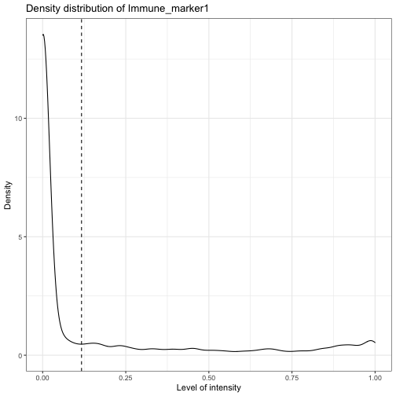

    ## [1] "Immune_marker2"

    ## [1] "Immune_marker3"

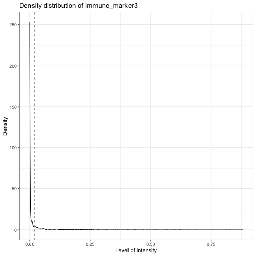

    ## [1] "Immune_marker4"

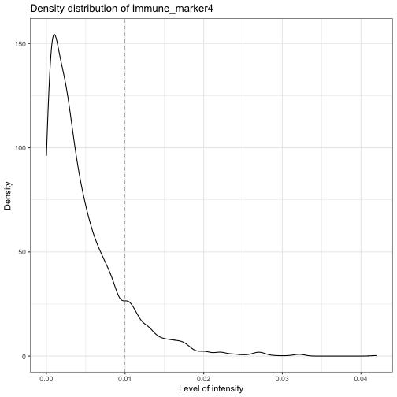

We can use `marker_prediction_plot` to plot the predicted cell
phenotypes and the ones obtained using HALO or InForm, for comparison.

    marker_prediction_plot(predicted_image, marker="Immune_marker1")

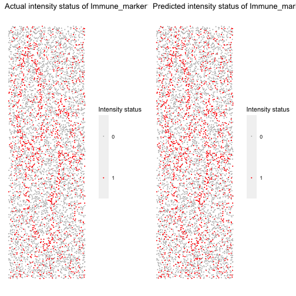

The plot shows Immune\_marker1+ cells in the tissue. On the left are the
Immune\_marker1+ cells defined by InForm and on the right are the
Immune\_marker1+ cells predicted using SPIAT. If this is simulated data,
then there are no cells defined by InForm. We can say that on the left
we have the phenotypes we had pre-defined and leave it at that.

Similar plots are generated for other markers. For example, the
following plots are for Tumour\_marker.

    marker_prediction_plot(predicted_image, marker="Tumour_marker")

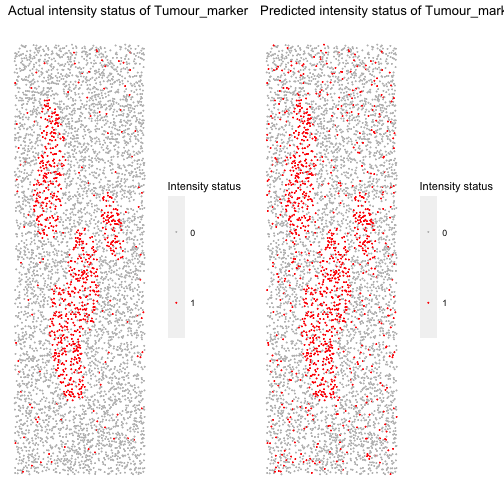

The next example shows how to replace the original phenotypes with the
predicted ones. Note that for this tutorial, we still use the original
phenotypes.

    predicted_image2 <- predict_phenotypes(sce_object = simulated_image,
                                          thresholds = NULL,
                                          tumour_marker = "Tumour_marker",
                                          baseline_markers = c("Immune_marker1", "Immune_marker2", "Immune_marker3", "Immune_marker4"),
                                          reference_phenotypes = FALSE)

    ## [1] "Tumour_marker  threshold intensity:  0.445450443784465"

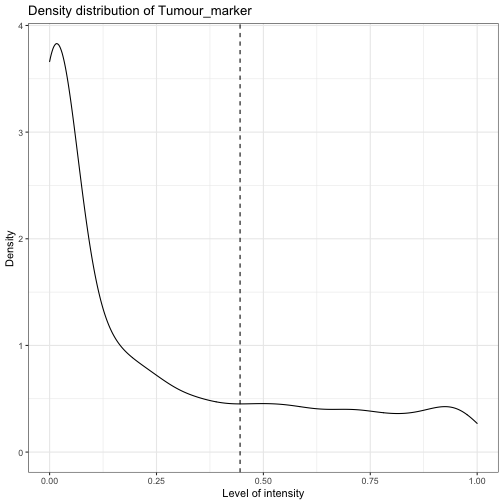

    ## [1] "Immune_marker1  threshold intensity:  0.116980867970434"

    ## [1] "Immune_marker2  threshold intensity:  0.124283809517202"

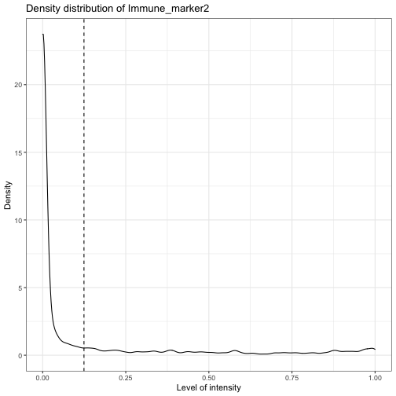

    ## [1] "Immune_marker3  threshold intensity:  0.0166413130263845"

    ## [1] "Immune_marker4  threshold intensity:  0.00989731350898589"

#### Specifying cell types

SPIAT can define cell types with the `define_celltypes` function. By
default the column is called Cell.Type. Note that this needs to be
specified by the user.

    formatted_image <- define_celltypes(simulated_image, 
                                        categories = c("Tumour_marker", "Immune_marker1,Immune_marker2", "Immune_marker1,Immune_marker3", 
                                                       "Immune_marker1,Immune_marker2,Immune_marker4", "OTHER"), 
                                        category_colname = "Phenotype",
                                        names = c("Tumour", "Immune1", "Immune2", 
                                                  "Immune3", "Others"),
                                        new_colname = "Cell.Type")

### Quality control

Here we present some quality control steps implemented in SPIAT to check
for the quality of phenotyping, help detect uneven staining, and other
potential technical artefacts.

#### Boxplots of marker intensities

Phenotyping of cells can be verified comparing marker intensities of
cells labelled positive and negative for a marker. Cells positive for a
marker should have high levels of the marker. An unclear separation of
marker intensities between positive and negative cells would suggest
phenotypes have not been accurately assigned. We can use
`marker_intensity_boxplot` to produce a boxplot for cells phenotyped as
being positive or negative for a marker.

    marker_intensity_boxplot(formatted_image, "Immune_marker1")

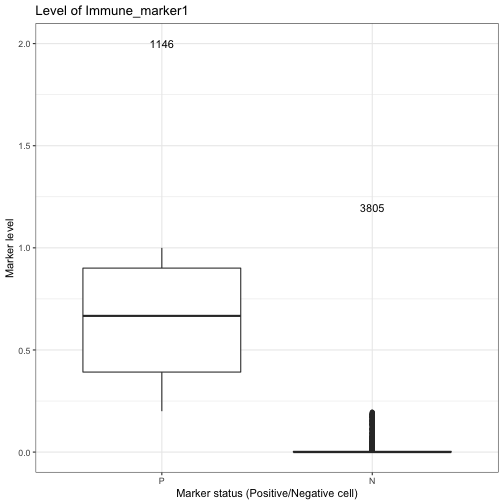

Note that if phenotypes were obtained from software that uses machine
learning to determine positive cells, which generally also take into
account properties such as cell shape, nucleus size etc., rather than a
strict threshold, some negative cells will have high marker intensities,
and vice versa. In general, a limited overlap of whiskers or outlier
points is tolerated and expected. However, overlapping boxplots suggests
unreliable phenotyping.

#### Scatter plots of marker levels

Uneven marker staining or high background intensity can be identified
with `plot_cell_marker_levels`. This produces a scatter plot of the
intensity of a marker in each cell. This should be relatively even
across the image and all phenotyped cells. Cells that were not
phenotyped as being positive for the particular marker are excluded.

    plot_cell_marker_levels(formatted_image, "Immune_marker1")

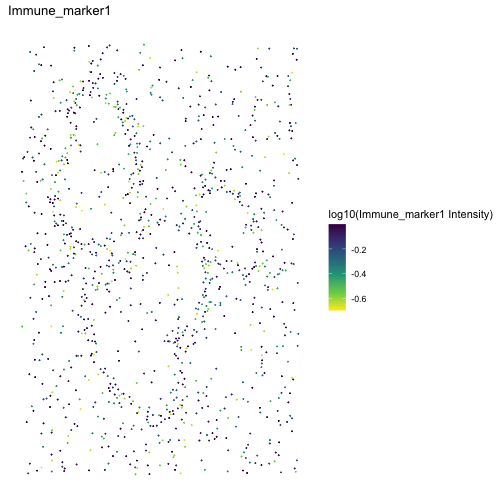

#### Heatmaps of marker levels

For large images, there is also the option of ‘blurring’ the image,
where the image is split into multiple small areas, and marker
intensities are averaged within each. The image is blurred based on the
`num_splits` parameter.

    plot_marker_level_heatmap(formatted_image, num_splits = 100, "Tumour_marker")

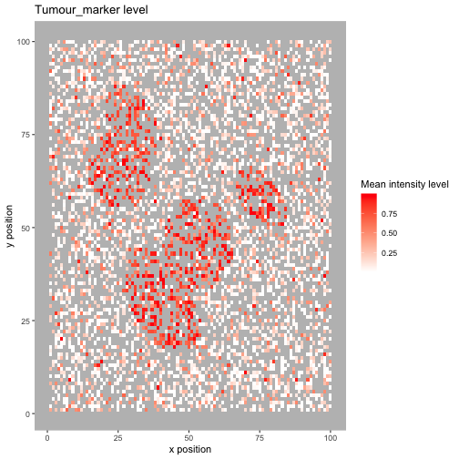

#### Identifying incorrect phenotypes

We may see cells with biologically implausible combination of markers
present n the input data when using `print_feature`. For example, cells
might be incorrectly typed as positive for two markers that known to not
co-occur in a single cell type. Incorrect cell phenotypes may be present
due to low cell segmentation quality, antibody ‘bleeding’ from one cell
to another or inadequate marker thresholding.

If the number of incorrectly phenotyped cells is small (&lt;5%), we
advise simply removing these cells (see below). If it is a higher
proportion, we recommend checking the cell segmentation and phenotyping
methods, as a more systematic problem might be present.

#### Removing cells with incorrect phenotypes

If you identify incorrect phenotypes or have any you want to exclude you
can use `select_phenotypes`.

    data_subset <- select_celltypes(formatted_image, keep=TRUE,
                                    celltypes = c("Tumour_marker","Immune_marker1,Immune_marker3", "Immune_marker1,Immune_marker2",
                                                 "Immune_marker1,Immune_marker2,Immune_marker4"),
                                    feature_colname = "Phenotype")
    print_feature(data_subset, feature_colname = "Phenotype")

    ## [1] "Immune_marker1,Immune_marker2"               
    ## [2] "Tumour_marker"                               
    ## [3] "Immune_marker1,Immune_marker2,Immune_marker4"
    ## [4] "Immune_marker1,Immune_marker3"

In this vignette we will work with all the original phenotypes present
in `formatted_image`.

#### Dimensionality reduction to identify missclassified cells

We can also check for specific missclassified cells using dimensionality
reduction. SPIAT offers tSNE and UMAPs based on marker intensities to
visualize cells. Cells of distinct types should be forming clearly
different clusters.

The generated dimensionality reduction plots are interactive, and users
can hover over each cell and obtain the cell ID. Users can then remove
specific missclassified cells.

    predicted_image2 <- 
      define_celltypes(predicted_image2, 
                       categories = c("Tumour_marker", "Immune_marker1,Immune_marker2",
                                      "Immune_marker1,Immune_marker3", 
                                      "Immune_marker1,Immune_marker2,Immune_marker4"), 
                       category_colname = "Phenotype",
                       names = c("Tumour", "Immune1", "Immune2",  "Immune3"),
                       new_colname = "Cell.Type")

    # Delete cells with unrealistic marker combinations from the dataset
    predicted_image2 <- select_celltypes(predicted_image2, "Undefined", 
                                         feature_colname = "Cell.Type", keep = FALSE)

    # TSNE plot
    g <- dimensionality_reduction_plot(predicted_image2, plot_type = "TSNE", feature_colname = "Cell.Type")

    plotly::ggplotly(g)

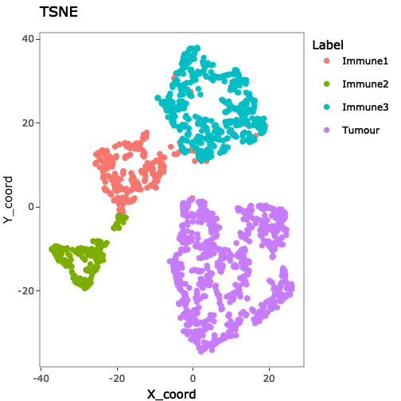

Note that `dimensionality_reduction_plot` only prints a statis version
of the UMAP or tSNE plot. If the user wants to interac with this plot,
they can pass the result to the `ggplotly` function from the `plotly`
package.

The plot shows that there are four clear clusters based on marker
intensities. This is consistent with the cell definition from the marker
combinations from the “Phenotype” column. The interactive TSNE plot
allows users to hover the cursor on the misclassified cells and see
their cell IDs. In this example, Cell\_3302, Cell\_4917, Cell\_2297,
Cell\_488, Cell\_4362, Cell\_4801, Cell\_2220, Cell\_3431, Cell\_533,
Cell\_4925, Cell\_4719, Cell\_469, Cell\_1929, Cell\_310, Cell\_2536,
Cell\_321, and Cell\_4195 are obviously misclassified according to this
plot.

We can use `select_celltypes` to delete the misclassified cells.

    predicted_image2 <- select_celltypes(predicted_image2, c("Cell_3302", "Cell_4917", "Cell_2297", "Cell_488", "Cell_4362", "Cell_4801", "Cell_2220", "Cell_3431", "Cell_533", "Cell_4925", "Cell_4719", "Cell_469", "Cell_1929", "Cell_310", "Cell_2536", "Cell_321", "Cell_4195"), feature_colname = "rowname", keep = FALSE)

Then plot the TSNE again. This time we see there are fewer
missclassified cells.

    # TSNE plot
    g <- dimensionality_reduction_plot(predicted_image2, plot_type = "TSNE", feature_colname = "Cell.Type")

    plotly::ggplotly(g)

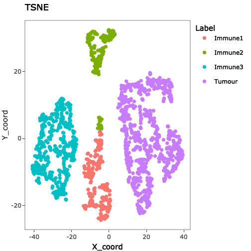

### Visualizing tissues

In addition to the marker level tissue plots for QC, SPIAT has other
methods for visualizing markers and phenotypes in tissues.

#### Categorical dot plot

We can see the location of all cell types (or any column in the data) in
the tissue with `plot_cell_categories`. Each dot in the plot corresponds
to a cell and cells are coloured by cell type. Any cell types present in
the data but not in the cell types of interest will be put in the
category “OTHER” and coloured lightgrey.

    my_colors <- c("red", "blue", "darkcyan", "darkgreen")
      
    plot_cell_categories(formatted_image, c("Tumour", "Immune1", "Immune2", "Immune3"), 
                         my_colors, "Cell.Type")

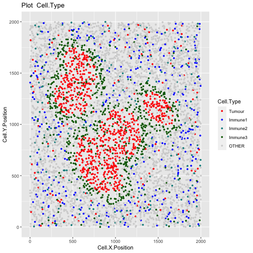

#### 3D surface plot

We can visualize a selected marker in 3D with `marker_surface_plot`. The
image is blurred based on the `num_splits` parameter.

    marker_surface_plot(formatted_image, num_splits=15, marker="Immune_marker1")

You can interactively move the plot around to obtain a better view.

#### 3D stacked surface plot

To visualize multiple markers in 3D in a single plot we can use
`marker_surface_plot_stack`. This shows normalized intensity level of
specified markers and enables the identification of co-occurring and
mutually exclusive markers.

    marker_surface_plot_stack(formatted_image, num_splits=15, markers=c("Tumour_marker", "Immune_marker1"))

The stacked surface plots of the Tumour\_marker and Immune\_marker1
cells in this example shows how Tumour\_marker and Immune\_marker1 are
mutually exclusive as the peaks and valleys are opposite. You can
interactively move the plot around to obtain a better view.

### Basic analyses

For this part of the tutorial, we will be performing some basic analysis
on this image:

Plot the image.

#### Cell percentages

We can obtain the number and proportion of each cell type with
`calculate_cell_proportions`. We can use `reference_celltypes` to
specify cell types to use as the reference. For example, “Total” will
calculate the proportion of each cell type against all cells. We can
exclude any cell types that are not of interest e.g. “Undefined” with
`celltypes_to_exclude`.

    p_cells <- calculate_cell_proportions(formatted_image, 
                                          reference_celltypes=NULL, 
                                          feature_colname ="Cell.Type",
                                          celltypes_to_exclude = "Others",
                                          plot.image = TRUE)

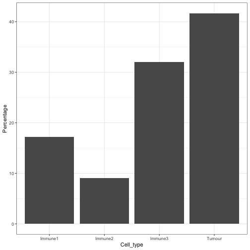

    p_cells

    ##   Cell_type Number_of_celltype Proportion Percentage Proportion_name
    ## 5    Tumour                819 0.41679389  41.679389          /Total
    ## 3   Immune3                630 0.32061069  32.061069          /Total
    ## 1   Immune1                338 0.17201018  17.201018          /Total
    ## 2   Immune2                178 0.09058524   9.058524          /Total

Alternatively, we can also visualize cell type proportions as barplots
using `plot_cell_percentages`.

    plot_cell_percentages(cell_proportions = p_cells, 
                          cells_to_exclude = "Tumour", cellprop_colname="Proportion_name")

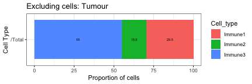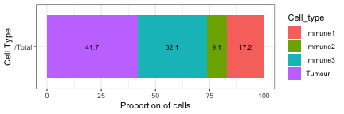

#### Cell distances

##### Pairwise cell distances

We can calculate the pairwise distances between two cell types (cell
type A and cell type B) with
`calculate_pairwise_distances_between_cell_types`. This function
calculates the distances of all cells of type A against all cells of
type B.

This function returns a data.frame that contains all the pairwise
distances between each cell of cell type A and cell type B.

    distances <- calculate_pairwise_distances_between_celltypes(formatted_image, 
                                                        cell_types_of_interest = c("Tumour", "Immune1", "Immune3"),
                                                        feature_colname = "Cell.Type")

The pairwise distances can be visualized as a violin plot with
`plot_cell_distances_violin`.

    plot_cell_distances_violin(distances)

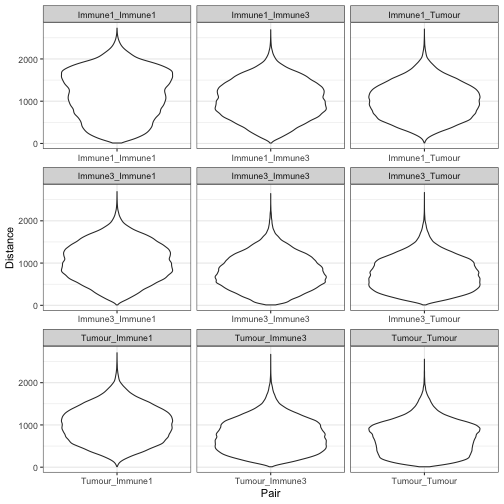

We can also calculate summary statistics for the distances between each
combination of cell types, the mean, median, min, max and standard
deviation, with `calculate_summary_distances_between_cell_types`.

    summary_distances <- calculate_summary_distances_between_celltypes(distances)

    summary_distances

    ##              Pair      Mean      Min      Max    Median  Std.Dev Reference
    ## 1 Immune1_Immune1 1164.7096 10.84056 2729.120 1191.3645 552.0154   Immune1
    ## 2 Immune1_Immune3 1034.4960 10.23688 2691.514 1026.4414 442.2515   Immune1
    ## 3  Immune1_Tumour 1013.3697 13.59204 2708.343 1004.6579 413.7815   Immune1
    ## 4 Immune3_Immune1 1034.4960 10.23688 2691.514 1026.4414 442.2515   Immune3
    ## 5 Immune3_Immune3  794.7765 10.17353 2645.302  769.9948 397.8863   Immune3
    ## 6  Immune3_Tumour  758.2732 10.02387 2670.861  733.4501 380.7703   Immune3
    ## 7  Tumour_Immune1 1013.3697 13.59204 2708.343 1004.6579 413.7815    Tumour
    ## 8  Tumour_Immune3  758.2732 10.02387 2670.861  733.4501 380.7703    Tumour
    ## 9   Tumour_Tumour  711.2657 10.00348 2556.332  703.9096 380.3293    Tumour
    ##    Target
    ## 1 Immune1
    ## 2 Immune3
    ## 3  Tumour
    ## 4 Immune1
    ## 5 Immune3
    ## 6  Tumour
    ## 7 Immune1
    ## 8 Immune3
    ## 9  Tumour

An example of the interpretation of this result is: ‘average pairwise
distance between cells of Immune3 and Immune1 is 1034.4959857.’

These pairwise cell distances can then be visualized as a heatmap with
`plot_distance_heatmap`. This example shows the average pairwise
distances between cell types. Note that the pairwise distances are
symmetrical (the average distance between cell type A and cell type B is
the same as the average distance between cell Type B and cell Type A).

    plot_distance_heatmap(summary_distances, metric = "mean")

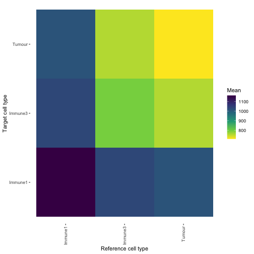

This plot shows that Tumour cells are interacting most closely with
Tumour cells and Immune3 cells.

##### Minimum cell distances

We can also calculate the minimum distances between cell types with
`calculate_minimum_distances_between_cell_types`. Unlike the pairwise
distance were we calculate the distance between all cell types of
interest, here we only identify the distance to the closest cell of type
B to each of the reference cells of type A.

    min_dist <- calculate_minimum_distances_between_celltypes(
      formatted_image, 
      cell_types_of_interest = c("Tumour", "Immune1", "Immune2","Immune3", "Others"),
      feature_colname = "Cell.Type")

    ## [1] "Markers had been selected in pair-wise distance calculation: "
    ## [1] "Others"  "Immune1" "Tumour"  "Immune3" "Immune2"

The minimum distances can be visualized as a violin plot with
`plot_cell_distances_violin`. Visualization of this distribution often
reveals whether pairs of cells are evenly spaced across the image, or
whether there are clusters of pairs of cell types.

    plot_cell_distances_violin(min_dist)

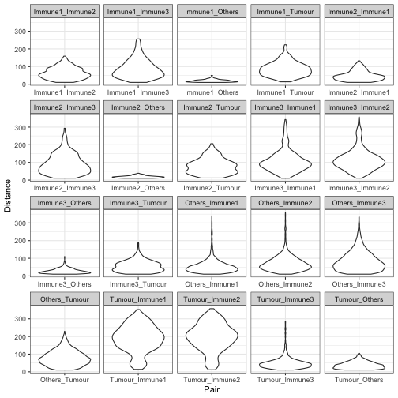

We can also calculate summary statistics for the distances between each
combination of cell types, the mean, median, min, max and standard
deviation, with `calculate_summary_distances_between_cell_types`.

    min_summary_dist <- calculate_summary_distances_between_celltypes(min_dist)

    # show the first five rows
    min_summary_dist[seq_len(5),]

    ##              Pair     Mean      Min       Max   Median  Std.Dev Reference
    ## 1 Immune1_Immune2 63.65211 10.33652 158.80504 59.01846 32.58482   Immune1
    ## 2 Immune1_Immune3 88.46152 10.23688 256.30328 77.21765 53.73164   Immune1
    ## 3  Immune1_Others 19.24038 10.05203  49.86409 17.49196  7.19293   Immune1
    ## 4  Immune1_Tumour 85.84773 13.59204 223.15809 80.80592 40.72454   Immune1
    ## 5 Immune2_Immune1 48.45885 10.33652 132.31086 43.71936 27.43245   Immune2
    ##    Target
    ## 1 Immune2
    ## 2 Immune3
    ## 3  Others
    ## 4  Tumour
    ## 5 Immune1

Unlike the pairwise distance, the minimum distances are not symmetrical,
and therefore we output a summary of the minimum distances specifying
the reference and target cell types used.

An example of the interpretation of this result is: ‘average minimum
distance between cells of Immune1 and Tumour is 85.8477321.’

Similarly, the summary statistics of the minimum distances can also be
visualised by a heatmap. This example shows the average minimum distance
between cell types.

    plot_distance_heatmap(min_summary_dist, metric = "mean")

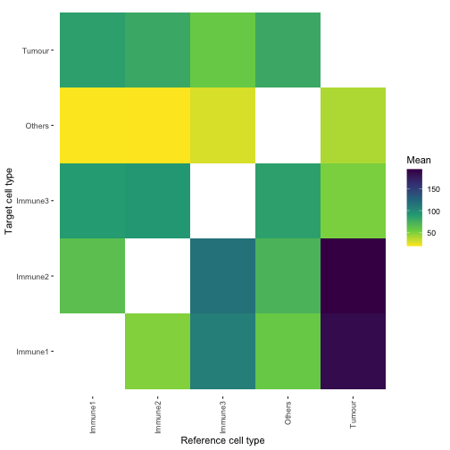

### Cell colocalization

With SPIAT we can quantify cell colozalization, which refers to how much
two cell types are colocalizing and thus potentially interacting.

#### Cells In Neighbourhood (CIN)

We can calculate the average percentage of cells of one cell type
(target) within a radius of another cell type (reference) using
`average_percentage_of_cells_within_radius`.

    average_percentage_of_cells_within_radius(formatted_image, 
                                              reference_celltype = "Immune1", 
                                              target_celltype = "Immune2", 
                                              radius=100, feature_colname="Cell.Type")

    ## [1] 4.768123

Alternatively, this analysis can also be performed based on marker
intensities rather than cell types. Here, we use
`average_marker_intensity_within_radius` to calculate the average
intensity of the target\_marker within a radius from the cells positive
for the reference marker. Note that it pools all cells with the target
marker that are within the specific radius of any reference cell.
Results represent the average intensities within a radius.

    average_marker_intensity_within_radius(formatted_image,
                                            reference_marker ="Immune_marker3",
                                            target_marker = "Immune_marker2",
                                            radius=30)

    ## [1] 0.5995357

To help identify suitable radii for
`average_percentage_of_cells_within_radius` and
`average_marker_intensity_within_radius` users can use
`plot_average_intensity`. This function calculates the average intensity
of a target marker for a number of user-supplied radii values, and plots
the intensity level at each specified radius as a line graph. The radius
unit is pixels.

    plot_average_intensity(formatted_image, reference_marker="Immune_marker3", 
                           target_marker="Immune_marker2", c(30, 35, 40, 45, 50, 75, 100))

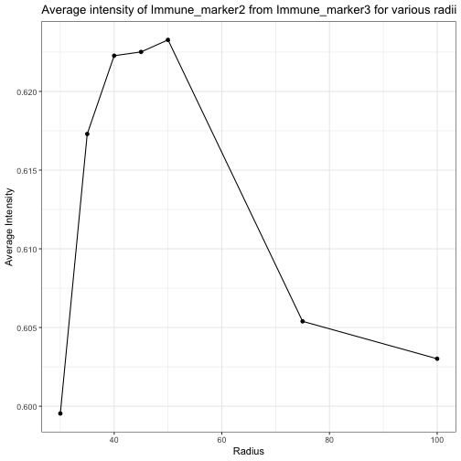

This plot shows low levels of Immune\_marker3 were observed in cells
near Immune\_marker2 cells and these levels increased at larger radii.
This suggests Immune\_marker2 and Immune\_marker3 cells may not be
closely interacting and are actually repelled.

#### Mixing Score (MS) and Normalized Mixing Score (NMS)

This score was originally defined as the number of immune-tumor
interactions divided by the number of immune-immune interactions (Keren
et al. 2018). SPIAT generalizes this method for any user-defined pair of
cell types. `mixing_score_summary` returns the mixing score between a
reference cell type and a target cell type. This mixing score is defined
as the number of target-reference interactions/number of
reference-reference interactions within a specified radius. The higher
the score the greater the mixing of the two cell types. The normalized
score is normalized for the number of target and reference cells in the
image.

    mixing_score_summary(formatted_image, reference_celltype = "Immune1", 
                         target_celltype = "Immune2", radius=100, feature_colname ="Cell.Type")

    ##   Reference  Target Number_of_reference_cells Number_of_target_cells
    ## 2   Immune1 Immune2                       338                    178
    ##   Reference_target_interaction Reference_reference_interaction Mixing_score
    ## 2                          583                            1184    0.4923986
    ##   Normalised_mixing_score
    ## 2                1.864476

#### Cross K function

Cross K function calculates the number of target cell types across a
range of raddi from a reference cell type, and compares the behaviour of
the input image with an image of randomly distributed points using a
Poisson point process. There are four patterns that can be distinguished
from K-cross function, as illustrated in the plots below. (taken from
[here](https://blog.jlevente.com/understanding-the-cross-k-function/) in
April 2021).

Here, the black line represents the input image, the red line represents
a randomly distributed point pattern.

-   1st plot: The red line and black line are close to each other,
    meaning the two types of points are randomly independently
    distributed.  
-   2nd plot: The red line is under the black line, with a large
    difference in the middle of the plot, meaning the points are mixed
    and split into clusters.  
-   3rd plot: With the increase of radius, the black line diverges
    further from the red line, meaning that there is one mixed cluster
    of two types of points.  
-   4th plot: The red line is above the black line, meaning that the two
    types of points form separated clusters.

We can calculate the cross K-function using SPIAT. Here, we need to
define which are the cell types of interest. In this example, we are
using Tumour cells as the reference population, and Immune3 cells as the
target population.

    df_cross <- calculate_cross_functions(formatted_image, method = "Kcross", 
                                          cell_types_of_interest = c("Tumour","Immune2"), 
                                          feature_colname ="Cell.Type",
                                          dist = 100)

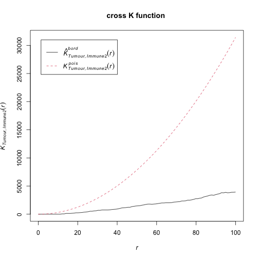
The results shows similar pattern as the 4th plot in the cross K
diagram. This means “Tumour” cells and “Immune2” cells are not
colocalised (or form separate clusters).

We can calculate the area under the curve (AUC) of the cross K-function.
In general, this tells us the two types of cells are:

-   negative values: separate clusters
-   positive values: mixing of cell types

<!-- -->

    AUC_of_cross_function(df_cross)

    ## [1] -0.2836735

The AUC score is close to zero so this tells us that the two types of
cells either do not have a relationship or they form a ring surrounding
a cluster.

#### Cross-K Intersection (CKI)

There is another pattern in cross K curve which has not been previously
appreciated, which is when there is a “ring” of one cell type, generally
immune cells, surrounding the area of another cell type, generally
tumour cells. For this pattern, the observed and expected curves in
cross K function cross or intersect, such as the cross K plot above.

We note that crossing is not exclusively present in cases where there is
an immune ring. When separate clusters of two cell types are close,
there can be a crossing at a small radius. In images with infiltration,
crossing may also happen at an extremely low distances due to
randomness. To use the CKI to detect a ring pattern, users need to
determine a threshold for when there is a true a immune ring. Based on
our tests, these are generally fall within at a quarter to half of the
image size, but users are encouraged to experiment with their dataset.

Here we use the colocalisation of “Tumour” and “Immune3” cells as an
example. Let’s revisit the example image.

Compute the cross K function between “Tumour” and “Immune3”:

    df_cross <- calculate_cross_functions(formatted_image, method = "Kcross", 
                                          cell_types_of_interest = c("Tumour","Immune3"), 
                                          feature_colname ="Cell.Type",
                                          dist = 100)

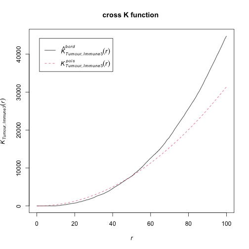
Then find the intersection of the observed and expected cross K curves.

    crossing_of_crossK(df_cross)

    ## [1] "Crossing of cross K function is detected for this image, indicating a potential immune ring."
    ## [1] "The crossing happens at the 50 % of the specified distance."

    ## [1] 0.5

The result shows that the crossing happens at 50% of the specified
distance (100) of the cross K function, which is very close to the edge
of the tumour cluster. This means that the crossing is not due to the
randomness in cell distribution, nor due to two close located immune and
tumour clusters. This result aligns with the observation that there is
an immune ring surrounding the tumour cluster.

### Spatial heterogeneity

Cell colocalization metrics allow capturing a dominant spatial pattern
in an image. However, patterns are unlikely to be distributed evenly in
an tissue, but rather there will be spatial heterogeneity of patterns.
To measure this, SPIAT splits the image into smaller images (either
using a grid or concentric circles around a reference cell population),
followed by calculation of a spatial metric of a pattern of interest
(e.g. cell colocalization, entropy), and then measures the Prevalance
and Distinctiveness of the pattern.

#### Localized Entropy

Entropy in spatial analysis refers to the balance in the number of cells
of distinct populations. An entropy score can be obtained for an entire
image. However, the entropy of one image does not provide us spatial
information of the image.

    calculate_entropy(formatted_image, cell_types_of_interest = c("Immune1","Immune2"), 
                      feature_colname = "Cell.Type")

    ## [1] 0.9294873

We therefore propose the concept of Localised Entropy, which calculates
an entropy score for a predefined local region. These local regions can
be calculated as defined in the next two sections.

#### Fish net grid

One approach to calculate localised metric is to split the image into
“fish-net” grid squares. For each grid square, `grid_metrics` calculate
the metric for that square and visualise the raster image. Users can
choose any metric as the localised metric. Here we use entropy as an
example.

For cases where the localised metric is not symmetrical (requires
specifying a target and reference cell type), the first iten in the
vector used for `cell_types_of_interest` marks the reference cells and
the second item the target cells. Here we are using Entropy, which is
not symmetrical, so we can use any order of cell types in the input.

    data("defined_image")
    grid <- grid_metrics(defined_image, FUN = calculate_entropy, n_split = 20,
                         cell_types_of_interest=c("Tumour","Immune3"), 
                         feature_colname = "Cell.Type")

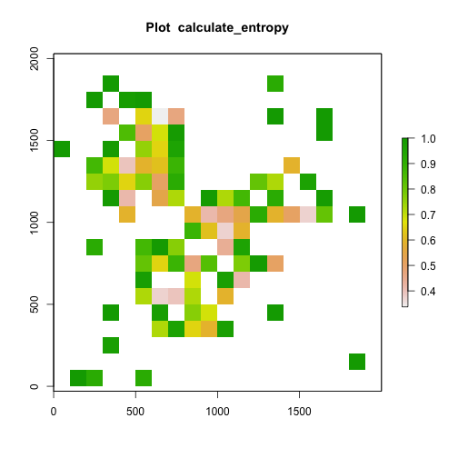

After calculating the localised entropy for each of the grid squares, we
can apply metrics like percentages of grid squares with patterns
(Prevalence) and Moran’s I (Distinctiveness).

For the Prevalence, we need to select a threshold over which grid
squares are considered ‘positive’ for the pattern. The selection of
threshold depends on the pattern and metric the user chooses to find the
localised pattern. Here we chose 0.75 for entropy because 0.75 is
roughly the entropy of two cell types when their ratio is 1:5 or 5:1.

    calculate_percentage_of_grids(grid, threshold = 0.75, above = TRUE)

    ## [1] 13

    calculate_spatial_autocorrelation(grid, metric = "globalmoran")

    ## [1] 0.09446964

#### Gradients (based on concentric circles)

We can use the `gradient` function to calculate metrics (entropy, mixing
score, percentage of cells within radius, marker intensity) for a range
of radii from reference cells. Here, an increasing circle is drawn
around each cell of the reference cell type and the desired score is
calculated for cells within each circle.

The first iten in the vector used for `cell_types_of_interest` marks the
reference cells and the second item the target cells. Here, Immune1
cells are reference cells and Immune2 are target cells.

    gradient_positions <- c(30, 50, 100)
    gradient_entropy <- 
      compute_gradient(defined_image, radii = gradient_positions, 
                       FUN = calculate_entropy,  cell_types_of_interest = c("Immune1","Immune2"),
                       feature_colname = "Cell.Type")
    length(gradient_entropy)

    ## [1] 3

    head(gradient_entropy[[1]])

    ##         Cell.X.Position Cell.Y.Position Immune1 Immune2 total Immune1_log2
    ## Cell_15       109.67027        17.12956       1       0     1            0
    ## Cell_25       153.22795       128.29915       1       0     1            0
    ## Cell_30        57.29037        49.88533       1       0     1            0
    ## Cell_48        83.47798       295.75058       2       0     2            1
    ## Cell_56        35.24227       242.84862       1       0     1            0
    ## Cell_61       156.39943       349.08154       2       0     2            1
    ##         Immune2_log2 total_log2 Immune1ratio Immune1_entropy Immune2ratio
    ## Cell_15            0          0            1               0            0
    ## Cell_25            0          0            1               0            0
    ## Cell_30            0          0            1               0            0
    ## Cell_48            0          1            1               0            0
    ## Cell_56            0          0            1               0            0
    ## Cell_61            0          1            1               0            0
    ##         Immune2_entropy entropy
    ## Cell_15               0       0
    ## Cell_25               0       0
    ## Cell_30               0       0
    ## Cell_48               0       0
    ## Cell_56               0       0
    ## Cell_61               0       0

The `compute_gradient` function outputs the numbers cells within each
radii for each reference cell. The output is formatted as a list of
data.frames, one for each specified radii. In each data.frame, the rows
show the reference cells. The last column of the data.frame is the
entropy calculated for cells in the circle of the reference cell. Users
can then an average score or another aggregation metric to report the
results.

An alternative approach is to combine the results of all the circles
(rather than have one for each individual reference cell). Here, for
each radii, we simultaneously identify all the cells in the circles
surrounding each reference cell, and calculate a single entropy score.
We have created a specific function for this -
`entropy_gradient_aggregated`. The output of this function is an overall
entropy score for each radii.

    gradient_pos <- seq(50, 500, 50) ##radii
    gradient_results <- entropy_gradient_aggregated(defined_image, cell_types_of_interest = c("Immune3","Tumour"),
                                                    feature_colname = "Cell.Type", radii = gradient_pos)
    # plot the results
    plot(1:10,gradient_results$gradient_df[1, 3:12])

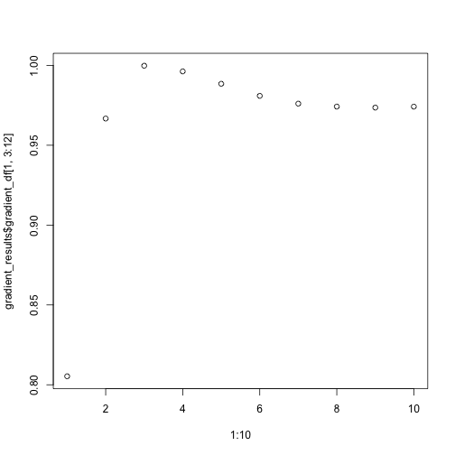

### Characterizing the immune microenvironment relative to the tumour margin

In certain analysis the focus is understanding the spatial distribution
of immune populations relative to the tumor margin. SPIAT includes
methods to determine whether there is a clear tumor margin, to
automatically identify the tumor margin, and finally to quantify the
proportion of immune populations relative to the margin.

#### Determining whether there is a clear tumor margin

In some instances tumor cells are distributed in such a way that there
are no clear tumor margins. While this can be derived intuitively in
most cases, SPIAT offers a way of quantifying the ‘quality’ of the
margin for downstream analyses. This is meant to be used to help flag
images with relatively poor margins, and therefore we do not offer a
cutoff value.

To determine if there is a clear tumour margin, SPIAT can calculate the
ratio of tumour bordering cells to tumour total cells (R-BT). This ratio
is high when there is a disproportional high number of tumor mangin
cells compared to internal tumor cells.

    R_BT(formatted_image, cell_type_of_interest = "Tumour", "Cell.Type")

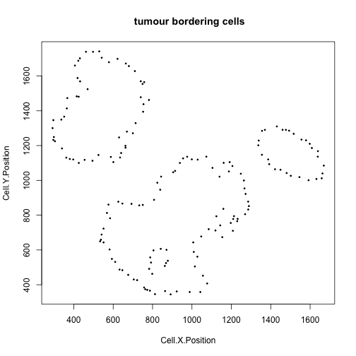

    ## [1] 0.2014652

The result is 0.2014652. This low value means there are relatively low
number of bordering cells compared to total tumor cells, meaning that
this image has clear tumor margins.

#### Automatic identification of the tumor margin

We can identify margins with `identify_bordering_cells`. This function
leverages off the alpha hull method (Pateiro-Lopez, Rodriguez-Casal,
and. 2019) from the alphahull package. Here we use tumour cells
(Tumour\_marker) as the reference to identify the bordering cells but
any cell type can be used.

    formatted_border <- identify_bordering_cells(formatted_image, 
                                                 reference_cell = "Tumour", 
                                                 feature_colname="Cell.Type")

    ## [1] "The alpha of Polygon is: 63.24375"

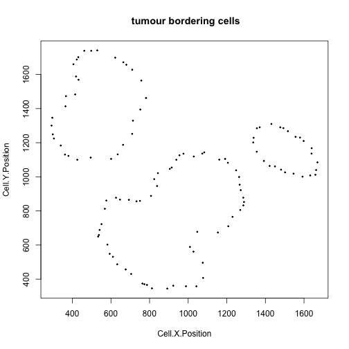

#### Classification of cells relative to their location to the margin

We can then define four locations relative to the margin based on
distances: “Internal margin,” “External margin,” “Outside” and “Inside.”
Specifically, we define the area within a specified distance to the
margin as either “Internal margin” (bordering the margin, inside the
tumor area) and “External margin” (bordering the margin, surrounding the
tumor area). The areas located further away than the specified distance
from the margin are defined as “Inside” (i.e. the tumor area) and
“Outside” (i.e. the tumor area).

First, we calculate the distance of cells to the tumor margin.

    formatted_distance <- calculate_distance_to_tumour_margin(formatted_border)

    ## [1] "Markers had been selected in pair-wise distance calculation: "
    ## [1] "Non-border" "Border"

Next, we classify cells based on their location. As a distance cutoff,
we use a distance of 5 cells from the tumor margin. The function first
calculates the average minimum distance between all pairs of nearest
cells and then multiples this number by 5. Users can change the number
of cell layers to increase/decrease the margin width.

    names_of_immune_cells <- c("Immune1", "Immune2","Immune3")

    formatted_structure <- define_structure(formatted_distance, 
                                            names_of_immune_cells = names_of_immune_cells, 
                                            feature_colname = "Cell.Type",
                                            n_margin_layers = 5)

    categories <- print_feature(formatted_structure, "Structure")

    ## [1] "Outside"                "Stromal.immune"         "Internal.margin"       
    ## [4] "Border"                 "External.margin.immune" "Internal.margin.immune"
    ## [7] "External.margin"        "Inside"                 "Infiltrated.immune"

We can plot and colour these structure categories.

    plot_cell_categories(formatted_structure, feature_colname = "Structure")

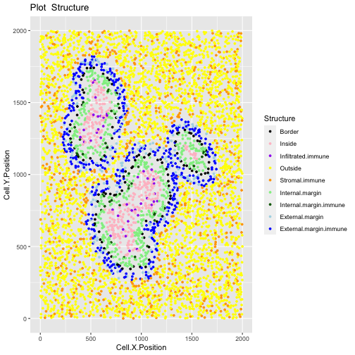

We can also calculate the proportion of immune cells in each of the
locations.

    immune_proportions <- calculate_proportions_of_cells_in_structure(formatted_structure, cell_types_of_interest = names_of_immune_cells, feature_colname ="Cell.Type")

    immune_proportions

    ##                Cell.Type                            Relative_to
    ## 1                Immune1             All_cells_in_the_structure
    ## 2                Immune2             All_cells_in_the_structure
    ## 3                Immune3             All_cells_in_the_structure
    ## 4                Immune1 All_cells_of_interest_in_the_structure
    ## 5                Immune2 All_cells_of_interest_in_the_structure
    ## 6                Immune3 All_cells_of_interest_in_the_structure
    ## 7                Immune1  The_same_cell_type_in_the_whole_image
    ## 8                Immune2  The_same_cell_type_in_the_whole_image
    ## 9                Immune3  The_same_cell_type_in_the_whole_image
    ## 10 All_cells_of_interest             All_cells_in_the_structure
    ##    P.Infiltrated.Immune P.Internal.Margin.Immune P.External.Margin.Immune
    ## 1            0.00000000               0.00000000              0.005494505
    ## 2            0.00000000               0.00000000              0.005494505
    ## 3            0.14385965               0.08780488              2.159340659
    ## 4            0.00000000               0.00000000              0.002531646
    ## 5            0.00000000               0.00000000              0.002531646
    ## 6            1.00000000               1.00000000              0.994936709
    ## 7            0.00000000               0.00000000              0.002958580
    ## 8            0.00000000               0.00000000              0.005617978
    ## 9            0.06507937               0.05714286              0.623809524
    ## 10           0.14385965               0.08780488              2.170329670
    ##    P.Stromal.Immune
    ## 1        0.11971581
    ## 2        0.06287744
    ## 3        0.05683837
    ## 4        0.50000000
    ## 5        0.26261128
    ## 6        0.23738872
    ## 7        0.99704142
    ## 8        0.99438202
    ## 9        0.25396825
    ## 10       0.23943162

Finally, we can calculate summaries of the distances for immune cells in
the tumour structure.

    immune_distances <- calculate_summary_distances_of_cells_to_borders(formatted_structure, cell_types_of_interest = names_of_immune_cells, "Cell.Type")

    immune_distances

    ##                    Cell.Type       Area    Min_d    Max_d    Mean_d  Median_d
    ## 1 All_cell_types_of_interest Tumor_area 10.93225 192.4094  86.20042  88.23299
    ## 2 All_cell_types_of_interest     Stroma 10.02387 984.0509 218.11106 133.18220
    ## 3                    Immune1 Tumor_area      Inf     -Inf       NaN        NA
    ## 4                    Immune1     Stroma 84.20018 970.7749 346.14096 301.01535
    ## 5                    Immune2 Tumor_area      Inf     -Inf       NaN        NA
    ## 6                    Immune2     Stroma 79.42753 984.0509 333.26374 284.09062
    ## 7                    Immune3 Tumor_area 10.93225 192.4094  86.20042  88.23299
    ## 8                    Immune3     Stroma 10.02387 971.5638 102.79227  68.19218
    ##    St.dev_d
    ## 1  45.27414
    ## 2 199.87586
    ## 3        NA
    ## 4 187.04247
    ## 5        NA
    ## 6 185.67518
    ## 7  45.27414
    ## 8 131.32714

Why are some Inf or NA. Please add an explanation.

### Cellular neighbourhoods

The aggregation of cells can result in ‘cellular neighbourhoods.’ A
neighbourhood is defined as a group of cells that cluster together.
These can be homotypic, containing cells of a single class (e.g. immune
cells), or heterotypic (e.g. containing a mixture of tumour and immune
cells).

SPIAT can identify cellular neighbourhoods with
`identify_neighborhoods`. Users can select a subset of cell types of
interest if desired. SPIAT include three algorithms for the detection of
neighbourhoods.

-   *Hierarchical Clustering algorithm*: Euclidean distances between
    cells are calculated, and pairs of cells with a distance less than a
    specified radius are considered to be ‘interacting,’ with the rest
    being ‘non-interacting.’ Hierarchical clustering is then used to
    separate the clusters. Larger radii will result in the merging of
    individual clusters.
-   *dbscan*
-   *phenograph*

For *Hierarchical Clustering algorithm* and *dbscan*, users need to
specify a radius that defines the distance for an interaction. We
suggest users to test different radii and select the one that generates
intuitive clusters upon visualization. Cells not assigned to clusters
are assigned to Cluster\_NA in the output table. The argument
`min_neighborhood_size` specifies the threshold of a neighborhood size
to be considered as a neighborhood. Smaller neighbourhoods will be
outputted, but will not be assigned a number.

*Rphenograph* uses the number of nearest neighbours to detect clusters.
This number should be specified by `min_neighborhood_size` argument. We
also encourage users to test different values.

For this part of the tutorial, we will use the image `image_no_markers`
simulated with the `spaSim` package. This image contains “Tumor,”
“Immune,” “Immune1” and “Immune2” cells without marker intensities.

    data("image_no_markers")

    plot_cell_categories(image_no_markers, c("Tumour", "Immune","Immune1","Immune2","Others"),
                         c("red","blue","darkgreen", "brown","lightgray"),"Cell.Type")

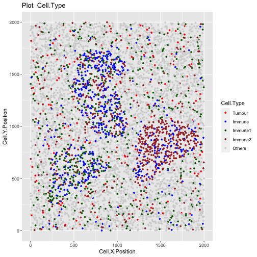

Users are recommended to test out different radii and then visualize the
clustering results. To aid in this process, users can use the
`average_minimum_distance` function, which calculates the average
minimum distance between all cells in an image, and can be used as a
starting point.

    average_minimum_distance(image_no_markers)

    ## [1] 17.01336

We then identify the cellular neighbourhoods using our heirarchical
algorithm with a radius of 50, and with a minimum neighbourhood size of
100. Cells assigned to neighbourhoods smaller than 100 will be assigned
to the “Cluster\_NA” neighbourhood.

    clusters <- identify_neighborhoods(image_no_markers, 
                                       method = "hierarchical",
                                       min_neighborhood_size = 100,
                                       cell_types_of_interest = c("Immune", "Immune1", "Immune2"), 
                                       radius = 50, feature_colname = "Cell.Type")

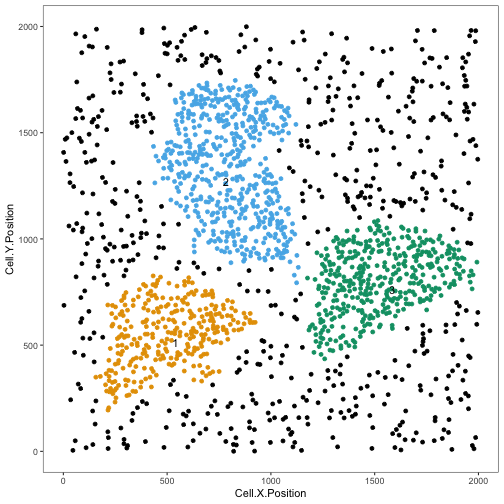

This plot shows clusters of Immune, Immune1 and Immune2 cells. Each
number and colour corresponds to a distinct cluster. Black cells
correspond to ‘free,’ un-clustered cells.

We can visualize the cell composition of neighborhoods. To do this, we
can use `composition_of_neighborhoods` to obtain the percentages of
cells with a specific marker within each neighborhood and the number of
cells in the neighborhood.

In this example we select cellular neighbourhoods with at least 5 cells.

    neighorhoods_vis <- composition_of_neighborhoods(clusters, feature_colname = "Cell.Type")
    neighorhoods_vis <- neighorhoods_vis[neighorhoods_vis$Total_number_of_cells >=5,]

Finally, we can use `plot_composition_heatmap` to produce a heatmap
showing the marker percentages within each cluster, which can be used to
classify the derived neighbourhoods.

    plot_composition_heatmap(neighorhoods_vis, feature_colname="Cell.Type")

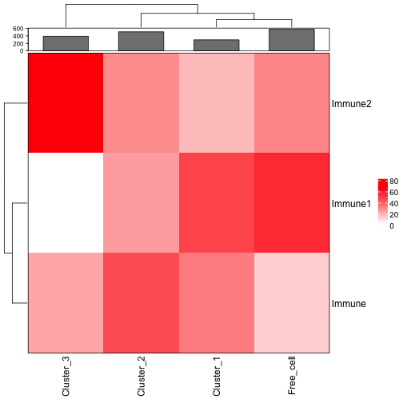

This plot shows that Cluster\_1 and Cluster\_2 contain all three types
of immune cells. Cluster\_3 does not have Immune1 cells. Cluster\_1 and
Cluster\_2 are more similar to the free cells (cells not assigned to
clusters) in their composition than Cluster\_3.

#### Average Nearest Neighbour Index (ANNI)

We can test for the presence of neighbourhoods using ANNI. We can
calculate the ANNI with the function `average_nearest_neighbor_index`,
which can take one cell type of interest (e.g. `Cluster_1` under
`Neighborhood` column of `clusters` object) or a combinations of cell
types (e.g. `Immune1` and `Immune2` cells under `Cell.Type` column of
`image_no_markers` object) and will output whether there is a clear
neighbourhood (clustered) or unclear (dispersed/random), along with a P
value for the estimate.

Here show the examples for both one cell type and multiple cell types.

    average_nearest_neighbor_index(clusters, reference_celltypes=c("Cluster_1"), 
                                   feature_colname="Neighborhood", p_val = 0.05)

    ## $pattern
    ## [1] "Clustered"
    ## 
    ## $`p-value`
    ## [1] 4.616213e-110

    average_nearest_neighbor_index(image_no_markers, reference_celltypes=c("Immune", "Immune1" , "Immune2"), 
                                   feature_colname="Cell.Type", p_val = 0.05)

    ## $pattern
    ## [1] "Random"
    ## 
    ## $`p-value`
    ## [1] 0.4000806

`p_val` is the cutoff to determine if a pattern is significant or not.
If the p value of ANNI is larger than the threshold, the pattern will be
“Random.” Although we give a default p value cutoff of 5e-6, we suggest
the users to define their own cutoff based on the images and how they
define the patterns “Cluster” and “Dispersed.”

## Reproducibility

    sessionInfo()

    ## R version 4.1.2 (2021-11-01)
    ## Platform: x86_64-apple-darwin17.0 (64-bit)
    ## Running under: macOS Big Sur 10.16
    ## 
    ## Matrix products: default
    ## BLAS:   /Library/Frameworks/R.framework/Versions/4.1/Resources/lib/libRblas.0.dylib
    ## LAPACK: /Library/Frameworks/R.framework/Versions/4.1/Resources/lib/libRlapack.dylib
    ## 
    ## locale:
    ## [1] en_AU.UTF-8/en_AU.UTF-8/en_AU.UTF-8/C/en_AU.UTF-8/en_AU.UTF-8
    ## 
    ## attached base packages:
    ## [1] stats4    stats     graphics  grDevices utils     datasets  methods  
    ## [8] base     
    ## 
    ## other attached packages:
    ##  [1] SPIAT_0.99.0                SingleCellExperiment_1.16.0
    ##  [3] SummarizedExperiment_1.24.0 Biobase_2.54.0             
    ##  [5] GenomicRanges_1.46.1        GenomeInfoDb_1.30.1        
    ##  [7] IRanges_2.28.0              S4Vectors_0.32.3           
    ##  [9] BiocGenerics_0.40.0         MatrixGenerics_1.6.0       
    ## [11] matrixStats_0.61.0          BiocStyle_2.22.0           
    ## 
    ## loaded via a namespace (and not attached):
    ##   [1] circlize_0.4.14        plyr_1.8.6             lazyeval_0.2.2        
    ##   [4] sp_1.4-6               splines_4.1.2          crosstalk_1.2.0       
    ##   [7] ggplot2_3.3.5          elsa_1.1-28            digest_0.6.29         
    ##  [10] foreach_1.5.2          htmltools_0.5.2        magick_2.7.3          
    ##  [13] fansi_1.0.2            magrittr_2.0.2         cluster_2.1.2         
    ##  [16] tensor_1.5             doParallel_1.0.17      tzdb_0.2.0            
    ##  [19] tripack_1.3-9.1        ComplexHeatmap_2.10.0  R.utils_2.11.0        
    ##  [22] vroom_1.5.7            spatstat.sparse_2.1-0  colorspace_2.0-3      
    ##  [25] ggrepel_0.9.1          xfun_0.30              dplyr_1.0.8           
    ##  [28] rgdal_1.5-28           callr_3.7.0            crayon_1.5.0          
    ##  [31] RCurl_1.98-1.6         jsonlite_1.8.0         spatstat_2.3-3        
    ##  [34] spatstat.data_2.1-2    iterators_1.0.14       glue_1.6.2            
    ##  [37] polyclip_1.10-0        gtable_0.3.0           zlibbioc_1.40.0       
    ##  [40] XVector_0.34.0         webshot_0.5.2          GetoptLong_1.0.5      
    ##  [43] DelayedArray_0.20.0    shape_1.4.6            apcluster_1.4.9       
    ##  [46] abind_1.4-5            scales_1.1.1           sgeostat_1.0-27       
    ##  [49] pheatmap_1.0.12        DBI_1.1.2              spatstat.random_2.1-0 
    ##  [52] Rcpp_1.0.8             viridisLite_0.4.0      clue_0.3-60           
    ##  [55] spatstat.core_2.4-0    bit_4.0.4              dittoSeq_1.6.0        
    ##  [58] htmlwidgets_1.5.4      httr_1.4.2             RColorBrewer_1.1-2    
    ##  [61] ellipsis_0.3.2         pkgconfig_2.0.3        R.methodsS3_1.8.1     
    ##  [64] farver_2.1.0           deldir_1.0-6           alphahull_2.2         
    ##  [67] utf8_1.2.2             tidyselect_1.1.2       labeling_0.4.2        
    ##  [70] rlang_1.0.2            reshape2_1.4.4         munsell_0.5.0         
    ##  [73] tools_4.1.2            cli_3.2.0              dbscan_1.1-10         
    ##  [76] generics_0.1.2         splancs_2.01-42        mmand_1.6.1           
    ##  [79] ggridges_0.5.3         evaluate_0.15          stringr_1.4.0         
    ##  [82] fastmap_1.1.0          yaml_2.3.5             goftest_1.2-3         
    ##  [85] processx_3.5.2         knitr_1.37             bit64_4.0.5           
    ##  [88] purrr_0.3.4            RANN_2.6.1             nlme_3.1-153          
    ##  [91] R.oo_1.24.0            pracma_2.3.8           compiler_4.1.2        
    ##  [94] rstudioapi_0.13        plotly_4.10.0          png_0.1-7             
    ##  [97] spatstat.utils_2.3-0   spatstat.linnet_2.3-2  tibble_3.1.6          
    ## [100] stringi_1.7.6          highr_0.9              ps_1.6.0              
    ## [103] lattice_0.20-45        Matrix_1.3-4           vctrs_0.3.8           
    ## [106] pillar_1.7.0           lifecycle_1.0.1        BiocManager_1.30.16   
    ## [109] spatstat.geom_2.3-2    GlobalOptions_0.1.2    data.table_1.14.2     
    ## [112] cowplot_1.1.1          bitops_1.0-7           raster_3.5-15         
    ## [115] R6_2.5.1               gridExtra_2.3          codetools_0.2-18      
    ## [118] gtools_3.9.2           assertthat_0.2.1       rjson_0.2.21          
    ## [121] GenomeInfoDbData_1.2.7 mgcv_1.8-38            parallel_4.1.2        
    ## [124] terra_1.5-21           grid_4.1.2             rpart_4.1-15          
    ## [127] tidyr_1.2.0            rmarkdown_2.12         Rtsne_0.15

## Author Contributions

AT, YF, TY, ML, JZ, VO, MD are authors of the package code. MD and YF
wrote the vignette. AT, YF and TY designed the package.

## References

Keren, Leeat, Marc Bosse, Diana Marquez, Roshan Angoshtari, Samir Jain,
Sushama Varma, Soo-Ryum Yang, et al. 2018. “A Structured Tumor-Immune
Microenvironment in Triple Negative Breast Cancer Revealed by
Multiplexed Ion Beam Imaging.” *Cell* 174 (6): 1373–87.

Pateiro-Lopez, Beatriz, Alberto Rodriguez-Casal, and. 2019. *Alphahull:
Generalization of the Convex Hull of a Sample of Points in the Plane*.
<https://CRAN.R-project.org/package=alphahull>.
