# spaSim vignette
{:.no_toc}

Yuzhou Feng, Anna Trigos

## Contents
{:.no_toc}

-   [Basics](#basics)
    -   [Installing `spaSim`](#installing-spasim)
    -   [Citing `spaSim`](#citing-spasim)
-   [Quick start to using `spaSim`](#quick-start-to-using-spasim)
    -   [Simulate an individual image](#simulate-an-individual-image)
        -   [Simulate background cells](#simulate-background-cells)
        -   [Simulate mixed background](#simulate-mixed-background)
        -   [Simulate clusters](#simulate-clusters)
        -   [Simulate immune rings](#simulate-immune-rings)
        -   [Simulate double rings](#simulate-double-rings)
        -   [Simulate vessels](#simulate-vessels)
        -   [Displaying the sequential construction of a simulated
            image](#displaying-the-sequential-construction-of-a-simulated-image)
    -   [Simulating a range of multiple
        images](#simulating-a-range-of-multiple-images)
        -   [Simulate multiple background images (multiple cell types)
            with different proportions of cell
            types.](#simulate-multiple-background-images-multiple-cell-types-with-different-proportions-of-cell-types.)
        -   [Simulate multiple images with clusters of different
            properties.](#simulate-multiple-images-with-clusters-of-different-properties.)
        -   [Simulate multiple images with immune rings of different
            properties](#simulate-multiple-images-with-immune-rings-of-different-properties)
    -   [Input simulated images into *SPIAT*
        package.](#input-simulated-images-into-spiat-package.)
-   [Citation](#citation)
-   [Reproducibility](#reproducibility)
-   [Bibliography](#bibliography)
{:toc}

## Basics

spaSim (**spa**tial **Sim**ulator) is a simulator of tumor immune
microenvironment spatial data. It includes a family of functions to
simulate a diverse set of cell localization patterns in tissues.
Patterns include background cells (one cell type or multiple cell types
of different proportions), tumour/immune clusters, immune rings and
double immune rings and stripes (blood/lymphatic vessels).

As quantitative tools for spatial tissue image analysis have been
developed and need benchmarking, simulations from spaSim can be applied
to test and benchmark these tools and metrics. The output of spaSim are
images in SingleCellExperiment object format and can be used with SPIAT
(SPIAT (**Sp**atial **I**mage **A**nalysis of **T**issues) also
developed by our team.

### Installing `spaSim`

*[spaSim](https://bioconductor.org/packages/3.14/spaSim)* is a `R`
package available via the [Bioconductor](http://bioconductor.org)
repository for packages. You can install the lasted development version
from Github. You can install spaSim using the following commands in your
`R` session:

    ## Check that you have a valid Bioconductor installation
    BiocManager::valid()
    if (!requireNamespace("BiocManager", quietly = TRUE)) {
          install.packages("BiocManager")
      }

    BiocManager::install("spaSim")

    # install from GitHub
    install.packages("devtools")
    devtools::install_github("TrigosTeam/spaSim", ref = "dev")

### Citing `spaSim`

We hope that *[spaSim](https://bioconductor.org/packages/3.14/spaSim)*
will be useful for your research. Please use the following information
to cite the package and the overall approach. Thank you!

    ## Citation info
    citation("spaSim")
    #> 
    #> To cite package 'spaSim' in publications use:
    #> 
    #>   Yuzhou Feng and Anna Trigos (2022). spaSim: Spatial point data
    #>   simulator for tissue images. R package version 0.99.0.
    #>   https://trigosteam.github.io/spaSim/
    #> 
    #> A BibTeX entry for LaTeX users is
    #> 
    #>   @Manual{,
    #>     title = {spaSim: Spatial point data simulator for tissue images},
    #>     author = {Yuzhou Feng and Anna Trigos},
    #>     year = {2022},
    #>     note = {R package version 0.99.0},
    #>     url = {https://trigosteam.github.io/spaSim/},
    #>   }

## Quick start to using `spaSim`

First attach the package

    library(spaSim)

### Simulate an individual image

In spaSim, spatial patterns are simulated on separate layers
sequentially starting from ‘background cells’ which serve as the canvas
for higher order structures (e.g. tumour clusters, immune clusters and
immune rings can be simulated after/on top of background cells). Here we
will go through each of these steps.

#### Simulate background cells

First we randomly generate the spatial locations of generic ‘background
cells’ (without cell identities). The ‘background cells’ will serve as
the input to the other simulation functions shown below which can assign
new identities to these cells in a structured or unstructured way.

Background images are simulated with a Hardcore Process, which is a
Poisson process where events (i.e. cells) are maintained at a specific
minimum distance from each other. As `rHardcore` from `spatstat.random`
package deletes cells based on this requirement, our function uses a
`oversampling_rate` to create more cells than the target number of cells
(`n_cells`) to ensure the resulting image has the number of cells
specified. If the resulting image ends up with slightly fewer cells than
specified, increase the `oversampling_rate` argument to account for
this.

    set.seed(610)
    bg <- simulate_background_cells(n_cells = 5000,
                                    width = 2000,
                                    height = 2000,
                                    min_d = 10,
                                    oversampling_rate = 1.6,
                                    Phenotype="Others")

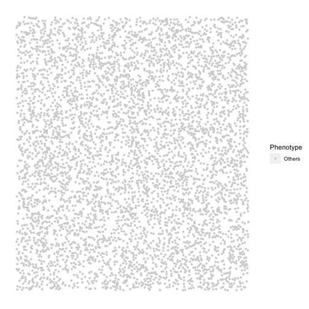

    head(bg)
    #>           Cell.X.Position Cell.Y.Position Phenotype
    #> Cell_55          156.3994        349.0815    Others
    #> Cell_2226        878.6766        633.4749    Others
    #> Cell_1113        569.0253        489.3713    Others
    #> Cell_4788       1996.0439        292.1873    Others
    #> Cell_4600       1756.8683       1608.0244    Others
    #> Cell_951         306.1119       1641.1277    Others
    # use dim(bg)[1] to check if the same number of cells are simulated. 
    # if not, increase `oversampling_rate`
    dim(bg)[1]
    #> [1] 5000

#### Simulate mixed background

To randomly assign ‘background cells’ to the the specified cell
identities in the specified proportions in an unstructured manner,
spaSim includes the `simulate_mixing` function.

Users can use the background image they defined earlier (e.g. `bg`), or
the image predefined in the package (`bg1`) as the ‘background cells’ to
further construct the mixed cell identities. In this example, we use
`bg` that was defined in the previous section.

The `props` argument defines the proportions of each cell type in
`idents`. Although the proportions are specified, the exact cells that
are assigned by each identity are stochastic. Therefore, users are
encouraged to use the set.seed() function to ensure reproducibility.

    mix_bg <- simulate_mixing(bg_sample = bg,
                              idents = c("Tumour", "Immune", "Others"),
                              props = c(0.2, 0.3, 0.5), 
                              plot_image = TRUE,
                              plot_colours = c("red","darkgreen","lightgray"))

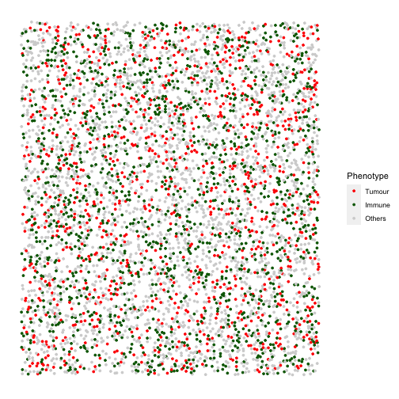

#### Simulate clusters

This function aims to simulate cells that aggregate as clusters like
tumour clusters or immune clusters. Tumour clusters can be circles or
ovals (or merging several ovals/circles together), and immune clusters
are irregular (or merging several irregular shapes together).

First, we specify the properties of clusters such their primary cell
type, size, shape and location. If infiltrating cell types are required,
we can also include their properties.

If there are multiple cell types lying in the cluster (e.g. tumour cells
and infiltrating cells), the assignment of identities to these cells is
random, using the random number sampling technique.

    cluster_properties <- list(
      C1 =list(name_of_cluster_cell = "Tumour", size = 500, shape = "Oval", 
               centre_loc = data.frame(x = 600, y = 600),infiltration_types = c("Immune1", "Others"), 
               infiltration_proportions = c(0.1, 0.05)), 
      C2 = list(name_of_cluster_cell = "Immune1", size = 600,  shape = "Irregular", 
                centre_loc = data.frame(x = 1500, y = 500), infiltration_types = c("Immune", "Others"),
                infiltration_proportions = c(0.1, 0.05)))
    # can use any defined image as background image, here we use mix_bg defined in the previous section
    clusters <- simulate_clusters(bg_sample = mix_bg,
                                  n_clusters = 2,
                                  bg_type = "Others",
                                  win = NULL,
                                  cluster_properties = cluster_properties,
                                  plot_image = TRUE,
                                  plot_categories = c("Tumour" , "Immune", "Immune1", "Others"),
                                  plot_colours = c("red", "darkgreen", "darkblue", "lightgray"))

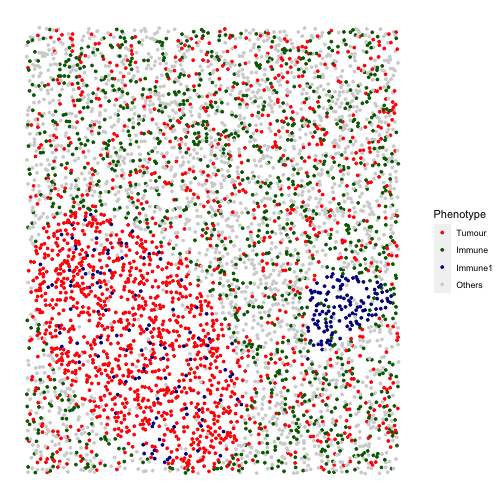

The simulated image shows a tumour cluster and an immune cluster on a
mixed background image. The primary cell type of the tumour cluster is
“Tumour”, with some “Immune1” and “Others” cells also within the tumour
cluster. The primary cell type of the immune cluster is “Immune1”, with
some “Immune2” and “Others” cells also within the immune cluster.

#### Simulate immune rings

This function aims to simulate tumour clusters and an immune ring
surrounding each of the clusters, which represent immune cells excluded
to the tumor margin.

First, we specify the properties of immune rings such their primary
(inner cluster) and secondary (outer ring) cell types, size, shape,
width and location. Properties of cells infiltrating into the inner mass
or outer ring can also be set.

If there are multiple cell types lying in the cluster and the immune
ring, the assignment of identities to these cells is random, using the
random number sampling technique.

    immune_ring_properties <- list(
      I1 = list(name_of_cluster_cell = "Tumour", size = 500, 
                shape = "Circle", centre_loc = data.frame(x = 930, y = 1000), 
                infiltration_types = c("Immune1", "Immune2", "Others"), 
                infiltration_proportions = c(0.15, 0.05, 0.05),
                name_of_ring_cell = "Immune1", immune_ring_width = 150,
                immune_ring_infiltration_types = c("Immune2", "Others"), 
                immune_ring_infiltration_proportions = c(0.1, 0.15)))
    rings <- simulate_immune_rings(
      bg_sample = bg,
      bg_type = "Others",
      n_ir = 1,
      win = NULL,
      ir_properties = immune_ring_properties,
      plot_image = TRUE,
      plot_categories = c("Tumour", "Immune1", "Immune2", "Others"),
      plot_colours = c("red", "darkgreen", "darkblue", "lightgray"))

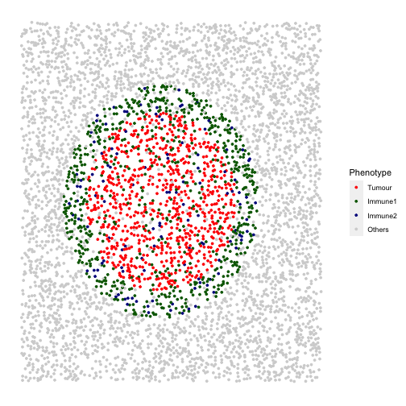

spaSim also allows simulation of two shapes overlapping each other. An
algorithm is then used to make the inner mass and outer rings of the
different shapes cohesive. An example is shown below. Overlapping of
shapes is also possible for clusters and double rings.

    immune_ring_properties <- list( 
      I1 = list(name_of_cluster_cell = "Tumour", size = 500, 
                shape = "Circle", centre_loc = data.frame(x = 930, y = 1000), 
                infiltration_types = c("Immune1", "Immune2", "Others"), 
                infiltration_proportions = c(0.15, 0.05, 0.05),
                name_of_ring_cell = "Immune1", immune_ring_width = 150,
                immune_ring_infiltration_types = c("Immune2", "Others"), 
                immune_ring_infiltration_proportions = c(0.1, 0.15)), 
      I2 = list(name_of_cluster_cell = "Tumour", size = 400, shape = "Oval",
               centre_loc = data.frame(x = 1330, y = 1100), 
               infiltration_types = c("Immune1",  "Immune2", "Others"), 
               infiltration_proportions = c(0.15, 0.05, 0.05),
               name_of_ring_cell = "Immune1", immune_ring_width = 150,
               immune_ring_infiltration_types = c("Immune2","Others"), 
               immune_ring_infiltration_proportions = c(0.1, 0.15)))

    rings <- simulate_immune_rings(bg_sample = bg,
                                  bg_type = "Others",
                                  n_ir = 2,
                                  win = NULL,
                                  ir_properties = immune_ring_properties,
                                  plot_image = TRUE,
                                  plot_categories = c("Tumour", "Immune1", "Immune2", "Others"),
                                  plot_colours = c("red", "darkgreen", "darkblue", "lightgray"))

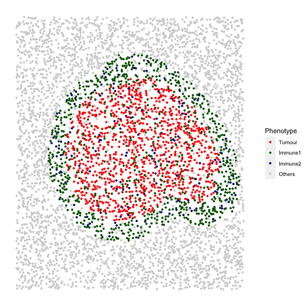

#### Simulate double rings

This function aims to simulate tumour clusters with an inner ring
(internal tumour margin) and an outer ring (external tumour margin).

First, we specify the properties of double rings such their primary
(inner mass), secondary (inner ring), and tertiary (outer ring) cell
types, size, shape, width and location. Properties of cells infiltrating
into the inner mass or either ring can also be set. If there are
multiple cell types lying in the tumour cluster and the double rings,
the assignment of identities to the cells is random, using the random
number sampling technique.

Similar to the above case, we are placing two double immune rings that
overlap with each other to form a more complex shape.

    double_ring_properties <- list(
     I1 = list(name_of_cluster_cell = "Tumour", size = 300, shape = "Circle", 
               centre_loc = data.frame(x = 1000, y = 1000), 
               infiltration_types = c("Immune1", "Immune2", "Others"), 
               infiltration_proportions = c(0.15, 0.05, 0.05), 
               name_of_ring_cell = "Immune1", immune_ring_width = 80,
               immune_ring_infiltration_types = c("Tumour", "Others"), 
               immune_ring_infiltration_proportions = c(0.1, 0.15), 
               name_of_double_ring_cell = "Immune2", double_ring_width = 100,
               double_ring_infiltration_types = c("Others"), 
               double_ring_infiltration_proportions = c( 0.15)),      
     I2 = list(name_of_cluster_cell = "Tumour", size = 300, shape = "Oval",
               centre_loc = data.frame(x = 1200, y = 1200), 
               infiltration_types = c("Immune1", "Immune2", "Others"), 
               infiltration_proportions = c(0.15, 0.05, 0.05),
               name_of_ring_cell = "Immune1", immune_ring_width = 80,
               immune_ring_infiltration_types = c("Tumour","Others"), 
               immune_ring_infiltration_proportions = c(0.1,0.15), 
               name_of_double_ring_cell = "Immune2", double_ring_width = 100,
               double_ring_infiltration_types = c("Others"), 
               double_ring_infiltration_proportions = c(0.15)))
    double_rings <- simulate_double_rings(bg_sample = bg1,
                                         bg_type = "Others",
                                         n_dr = 2,
                                         win = NULL,
                                         dr_properties = double_ring_properties,
                                         plot_image = TRUE,
                                         plot_categories = c("Tumour", "Immune1", "Immune2", "Others"),
                                         plot_colours = c("red", "darkgreen", "darkblue", "lightgray"))

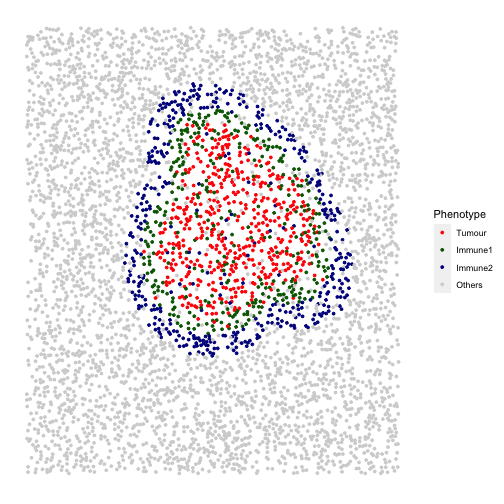

The simulated image shows two layers of immune rings. The primary cell
type in the inner ring (internal tumour margin) is coloured green, with
some “Tumour” cells also lie in the inner ring. The outer ring (external
tumour margin) is coloured blue, with some other “Others” cells also lie
in the outer ring.

#### Simulate vessels

This function aims to simulate stripes of cells representing
blood/lymphatic vessels. First, we specify the properties of vessel
structures such as the number present, their width, and the properties
of their infiltrating cells. We then randomly assign ‘background cells’
which lie within these vessel structures to the specified cell
identities in the specified proportions.

The locations of the vessels are stochastic.

    properties_of_stripes = list(
     S1 = list(number_of_stripes = 1, name_of_stripe_cell = "Immune1", 
               width_of_stripe = 40, infiltration_types = c("Others"),
               infiltration_proportions = c(0.08)), 
     S2 = list(number_of_stripes = 5, name_of_stripe_cell = "Immune2", 
               width_of_stripe = 40, infiltration_types = c("Others"), 
               infiltration_proportions = c(0.08)))
    vessles <- simulate_stripes(bg_sample = bg1,
                               n_stripe_type = 2,
                               win = NULL,
                               stripe_properties = properties_of_stripes,
                               plot_image = TRUE)

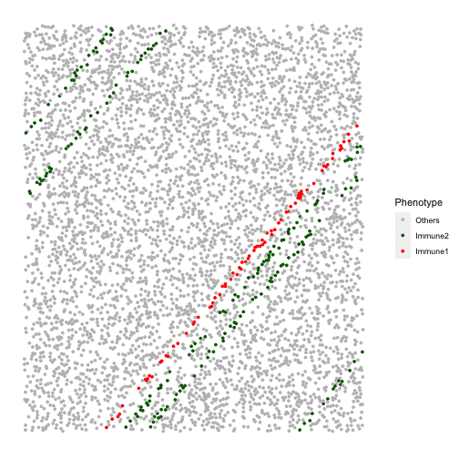

#### Displaying the sequential construction of a simulated image

The `TIS` (**T**issue **I**mage **S**imulator) function simulates
multiple patterns layer by layer and displays the pattern construction
sequentially. The patterns are simulated in the order of: background
cells, mixed background cells, clusters (tumour/immune), immune rings,
double immune rings, and vessels.

Not all patterns are required for using this function. If a pattern is
not needed, simply use `NULL` for the pattern arguments. The example
simulates a background sample with a tumour cluster and an immune ring
on it (3 patterns: background image -&gt; tumour cluster -&gt; immune
ring surrounding tumour cluster).

    # First specify the cluster and immune ring properties
    ## tumour cluster properties
    properties_of_clusters = list(
     C1 = list( name_of_cluster_cell = "Tumour", size = 300, shape = "Oval", 
                centre_loc = data.frame("x" = 500, "y" = 500),
                infiltration_types = c("Immune1", "Others"), 
                infiltration_proportions = c(0.3, 0.05)))
    ## immune ring properties
    immune_ring_properties <- list( 
      I1 = list(name_of_cluster_cell = "Tumour", size = 300, 
                shape = "Circle", centre_loc = data.frame(x = 1030, y = 1100), 
                infiltration_types = c("Immune1", "Immune2", "Others"), 
                infiltration_proportions = c(0.15, 0.05, 0.05),
                name_of_ring_cell = "Immune1", immune_ring_width = 150,
                immune_ring_infiltration_types = c("Others"), 
                immune_ring_infiltration_proportions = c(0.15)), 
      I2 = list(name_of_cluster_cell = "Tumour", size = 200, shape = "Oval",
               centre_loc = data.frame(x = 1430, y = 1400), 
               infiltration_types = c("Immune1",  "Immune2", "Others"), 
               infiltration_proportions = c(0.15, 0.05, 0.05),
               name_of_ring_cell = "Immune1", immune_ring_width = 150,
               immune_ring_infiltration_types = c("Others"), 
               immune_ring_infiltration_proportions = c(0.15)))
    # simulation
    # no background sample is input, TIS simulates the background cells from scratch
    # `n_cells`, `width`, `height`, `min_d` and `oversampling_rate` are parameters for simulating background cells
    # `n_clusters`, `properties_of_clusters` are parameters for simulating clusters on top of the background cells
    # `plot_image`, `plot_categories`, `plot_colours` are params for plotting
    simulated_image <- 
    TIS(bg_sample = NULL,
       n_cells = 5000,
       width = 2000,
       height = 2000,
       min_d = 10,
       oversampling_rate = 1.6, 
       n_clusters = 1,
       properties_of_clusters = properties_of_clusters,
       n_immune_rings = 2,
       properties_of_immune_rings = immune_ring_properties,
       plot_image = TRUE,
       plot_categories = c("Tumour", "Immune1", "Immune2", "Others"),
       plot_colours = c("red", "darkgreen", "darkblue", "lightgray"))

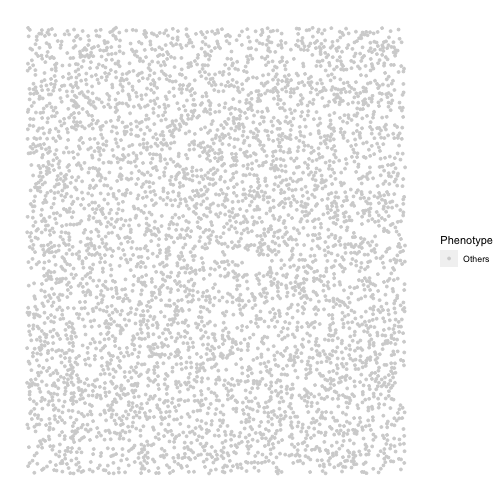

    #> [1] "Immune2 cells were not found and not plotted"

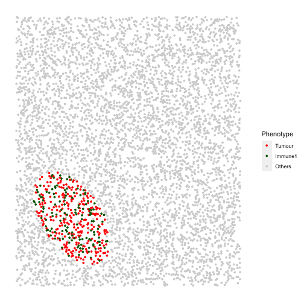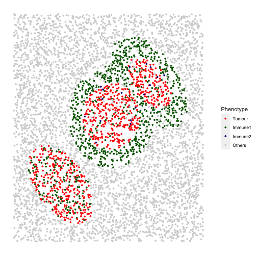

The results display the construction of a complex image with multiple
patterns. It started from a background image with cells of no
identities, then tumour a cluster is layered on the background image,
and finally, an immune ring that surrounds a tumour cluster is layered
on the very top.

### Simulating a range of multiple images

In some cases simulations of a set of images that span a range of
different properties of patterns are needed. Rather than simulating
images individually, simulating these images in one go is desirable. The
following functions create a quick interface to generate a range of
images with different parameters/randomised elements.

#### Simulate multiple background images (multiple cell types) with different proportions of cell types.

This function aims to simulate a set of images that contain different
proportions of specified cell types.

In this example we simulate 4 images with 10% Tumour cells and an
increasing number of Immune cells. We first specify the cell types and
the proportions of each cell type in each image.

    #cell types present in each image
    idents <- c("Tumour", "Immune", "Others")
    # Each vector corresponds to each cell type in `idents`. 
    # Each element in each vector is the proportion of the cell type in each image.
    # (4 images, so 4 elements in each vector)
    Tumour_prop <- rep(0.1, 4)
    Immune_prop <- seq(0, 0.3, 0.1)
    Others_prop <- seq(0.9, 0.6, -0.1)
    # put the proportion vectors in a list
    prop_list <- list(Tumour_prop, Immune_prop, Others_prop)

    # simulate 
    bg_list <- 
     multiple_background_images(bg_sample = bg, idents = idents, props = prop_list,
                                plot_image = TRUE, plot_colours = c("red", "darkgreen", "lightgray"))
    #> [1] 1
    #> [1] "Immune cells were not found and not plotted"

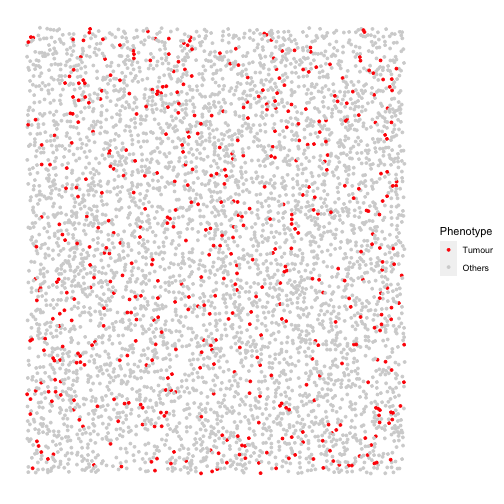

    #> [1] 2

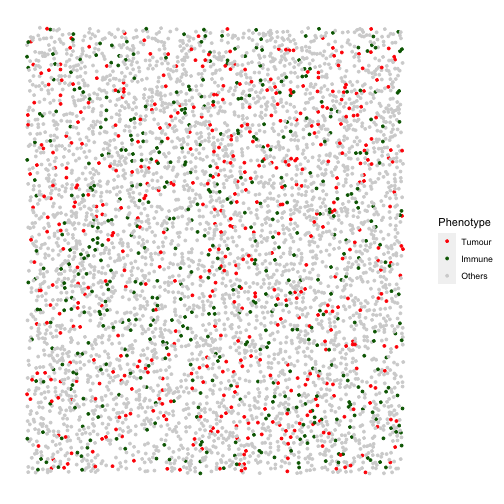

    #> [1] 3

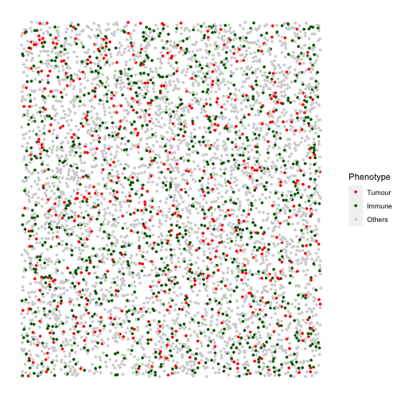

    #> [1] 4

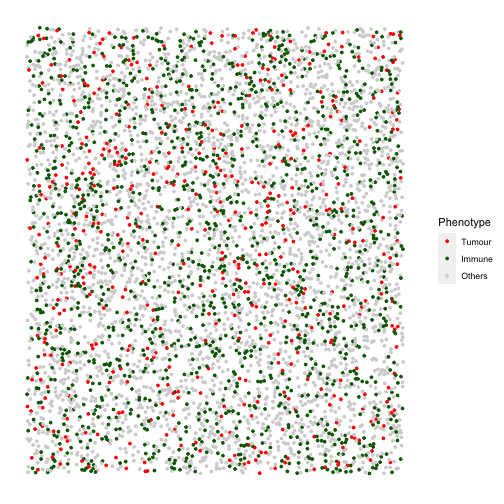

#### Simulate multiple images with clusters of different properties.

This function aims to simulate a set of images that contain different
tumour/immune clusters.

Note that in this function users cannot manually define the base shape
and the primary cell type of the clusters. There are three options (`1`,
`2`, and `3`) for the base shape available in the `cluster_shape`
argument. `1` for a simple cluster where all cells are “Tumour”, `2` for
a tumour cluster where the primary cell type is “Tumour” and there is
infiltration of types “Immune” and “Others”, and `3` for an immune
cluster where the primary cell type is “Immune” and the infiltration
cell types are “Immune1” and “Others”.

Here we simulate 4 images with increasing tumour cluster sizes using the
cluster shape `1`.

    # if a property is fixed, use a number for that parameter.
    # if a property spans a range, use a numeric vector for that parameter, e.g.
    range_of_size <- seq(200, 500, 100)
    cluster_list <- 
     multiple_images_with_clusters(bg_sample = bg1,
                                   cluster_shape = 1,
                                   prop_infiltration = 0.1,
                                   cluster_size = range_of_size,
                                   cluster_loc_x = 0,
                                   cluster_loc_y = 0,
                                   plot_image = TRUE,
                                   plot_categories = c("Tumour", "Immune", "Others"),
                                   plot_colours = c("red", "darkgreen", "lightgray"))

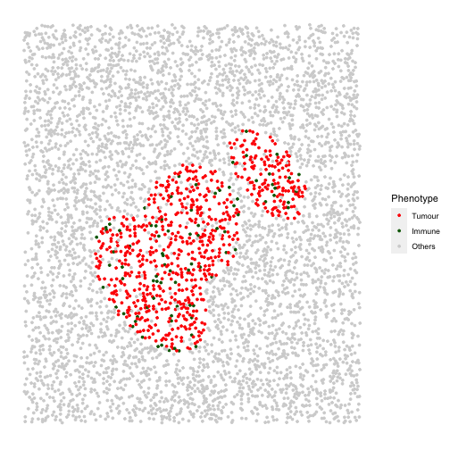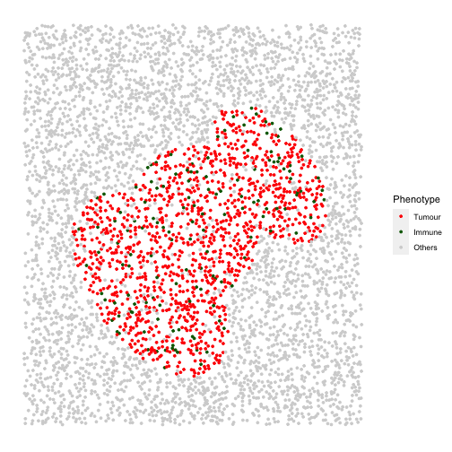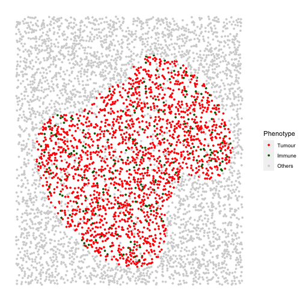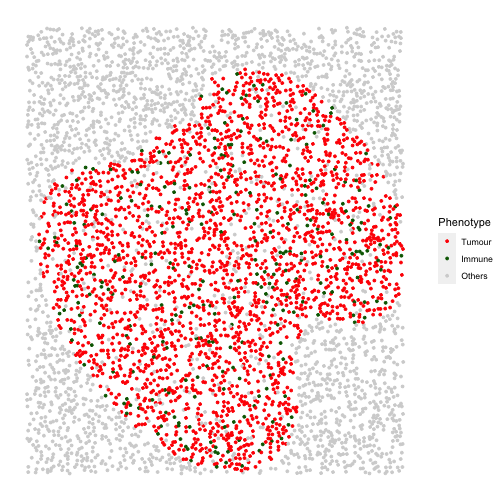

We will also include one example for shape `2` and one example for shape
`3`.

    # shape "2" - Tumour cluster with more and more immune infiltration
    range_of_infiltration <- c(0.1, 0.3, 0.5)
    cluster_list <- 
      multiple_images_with_clusters(bg_sample = bg1,
                                    cluster_shape = 2,
                                    prop_infiltration = range_of_infiltration,
                                    cluster_size = 200,
                                    cluster_loc_x = 0,
                                    cluster_loc_y = 0,
                                    plot_image = TRUE, 
                                    plot_categories = c("Tumour" , "Immune", "Others"),
                                    plot_colours = c("red","darkgreen", "lightgray"))

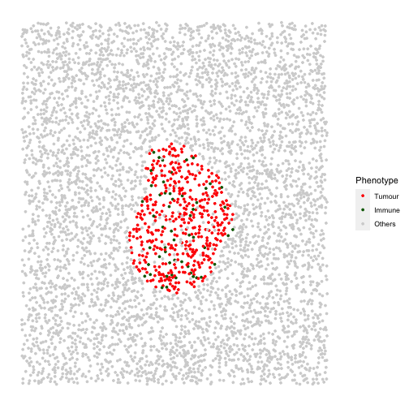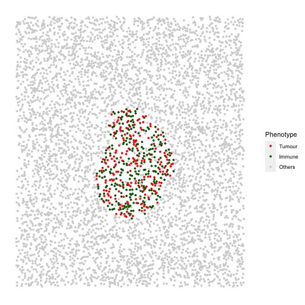

    # shape "3" - Immune cluster
    cluster_list <- 
      multiple_images_with_clusters(bg_sample = bg1,
                                     cluster_shape = 3,
                                     prop_infiltration = 0.1,
                                     cluster_size = 500,
                                     cluster_loc_x = 0,
                                     cluster_loc_y = 0,
                                     plot_image = TRUE, 
                                     plot_categories = c("Immune", "Others"),
                                     plot_colours = c("darkgreen", "lightgray"))

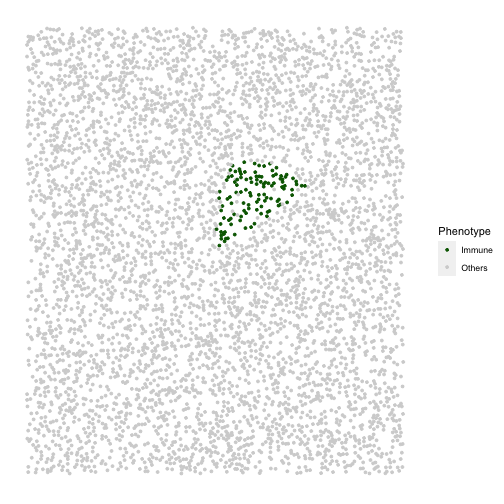

#### Simulate multiple images with immune rings of different properties

This function aims to simulate a set of images that contain different
tumour clusters with immune rings.

Note that similar to `multiple_images_with_clusters`, in this function
users cannot manually define the base shape and the primary cell type of
the clusters or the immune rings. There are three options for the base
shape (`1`, `2` and `3`) available in the `ring_shape` argument:

For `1` and `2`: - primary cluster cell type is “Tumour” - cluster
infiltration cell types are “Immune” and “Others” - primary ring cell
type is “Immune” - ring infiltration type is “Others”

For `3`: - primary cluster cell type is “Tumour” - cluster infiltration
cell types are “Immune” and “Others” - primary ring cell type is
“Immune” - ring infiltration type is “Tumour” and “Others”

The cluster size, infiltration proportions, cluster location, ring
width, and ring infiltration proportions can be defined.

Here we show 3 images with increasingly wider immune rings. First define
any parameter that has a range.

    # if a property is to be fixed, use a number for that parameter.
    # if a property is to span a range, use a numeric vector for that parameter, e.g.
    range_ring_width <- seq(50, 120, 30)

    # This example uses ring shape 1
    par(mfrow=c(2,1))
    immune_ring_list <- 
     multiple_images_with_immune_rings(bg_sample = bg,
                                       cluster_size = 200,
                                       ring_shape = 1,
                                       prop_infiltration = 0,
                                       ring_width = range_ring_width,
                                       cluster_loc_x = 0,
                                       cluster_loc_y = 0,
                                       prop_ring_infiltration = 0.1,
                                       plot_image = TRUE,
                                       plot_categories = c("Tumour", "Immune", "Others"),
                                       plot_colours = c("red", "darkgreen", "lightgray"))

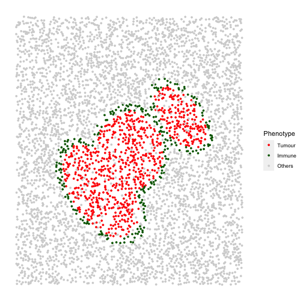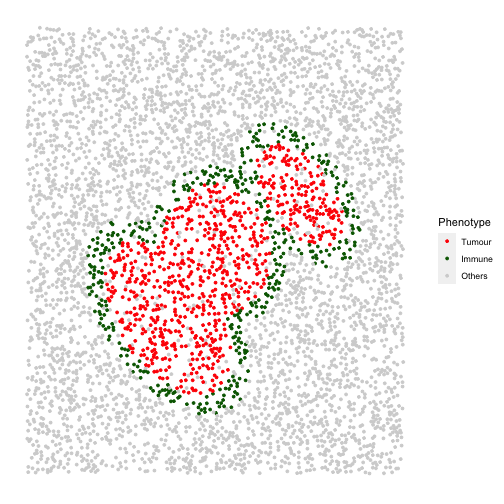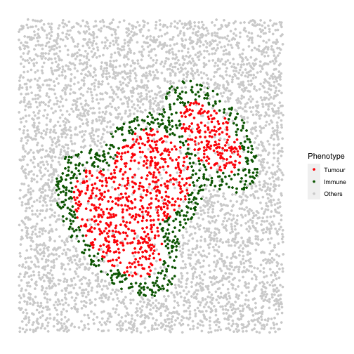

We will also include one example for ring shape `2` and one example for
ring shape `3`.

    # shape "2" - Immune ring at different locations
    cluster_loc_x <- c(-300, 0, 300)
    cluster_loc_y <- c(-300, 0, 300)
    immune_ring_list <- 
     multiple_images_with_immune_rings(bg_sample = bg,
                                       cluster_size = 200,
                                       ring_shape = 2,
                                       prop_infiltration = 0,
                                       ring_width = 70,
                                       cluster_loc_x = cluster_loc_x,
                                       cluster_loc_y = cluster_loc_y,
                                       prop_ring_infiltration = 0.1,
                                       plot_image = TRUE,
                                       plot_categories = c("Tumour", "Immune", "Others"),
                                       plot_colours = c("red", "darkgreen", "lightgray"))

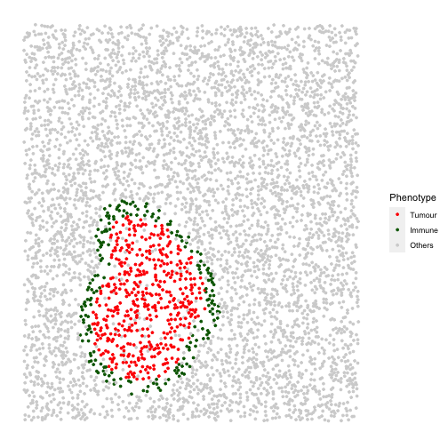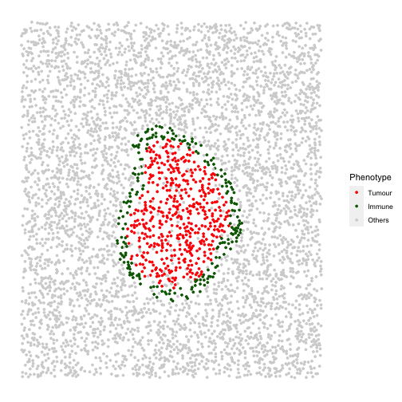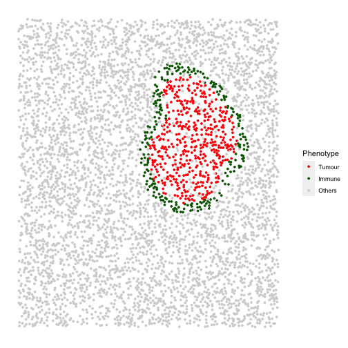

    # shape "3" - Immune ring has different "Tumour" proportions
    prop_ring_infiltration <- c(0.1, 0.2, 0.3)
    immune_ring_list <- 
     multiple_images_with_immune_rings(bg_sample = bg,
                                       cluster_size = 200,
                                       ring_shape = 2,
                                       prop_infiltration = 0,
                                       ring_width = 70,
                                       cluster_loc_x = 0,
                                       cluster_loc_y = 0,
                                       prop_ring_infiltration = prop_ring_infiltration,
                                       plot_image = TRUE,
                                       plot_categories = c("Tumour", "Immune", "Others"),
                                       plot_colours = c("red", "darkgreen", "lightgray"))

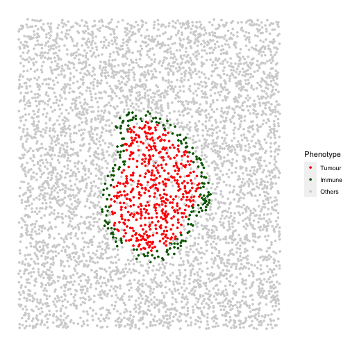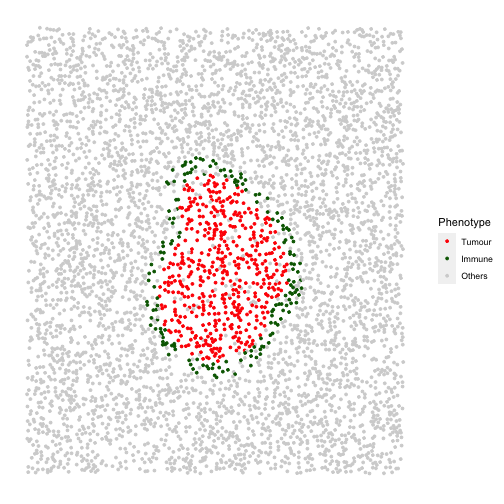

### Input simulated images into *[SPIAT](https://bioconductor.org/packages/3.14/SPIAT)* package.

As `SPIAT` uses SingleCellExperiment object as the basic data structure
for image processing and analysis, the simulated images from `spaSim`
can be directly used as input in `SPIAT` functions. Examples in `SPIAT`
packages use the images simulated by `spaSim`.

Here is an example of using `SPIAT` function on `spaSim` image. We use
`simulated_image` generated from one of the previous sections.

    # The following code will not run as SPIAT is still not released yet. You can try out the dev version on Github~
    # if (requireNamespace("SPIAT", quietly = TRUE)) {
    #   # visualise
    #   SPIAT::plot_cell_categories(sce_object = simulated_image, 
    #                               categories_of_interest = c("Tumour", "Immune1", "Immune2", "Others"),
    #                               colour_vector = c("red", "darkgreen", "darkblue", "lightgray"),
    #                               feature_colname = "Phenotype")
    #   # calculate average minimum distance of the cells
    #   SPIAT::average_minimum_distance(sce_object = simulated_image)
    #   # You can also try other functions :)
    # }

## Citation

Here is an example of you can cite the package.

-   *[spaSim](https://bioconductor.org/packages/3.14/spaSim)* (Feng and
    Trigos, 2022)

## Reproducibility

The *[spaSim](https://bioconductor.org/packages/3.14/spaSim)* package
(Feng and Trigos, 2022) was made possible thanks to:

-   R (R Core Team, 2021)
-   *[BiocStyle](https://bioconductor.org/packages/3.14/BiocStyle)*
    (Oleś, 2021)
-   *[knitr](https://CRAN.R-project.org/package=knitr)* (Xie, 2021)
-   *[RefManageR](https://CRAN.R-project.org/package=RefManageR)*
    (McLean, 2017)
-   *[rmarkdown](https://CRAN.R-project.org/package=rmarkdown)*
    (Allaire, Xie, McPherson, Luraschi, Ushey, Atkins, Wickham, Cheng,
    Chang, and Iannone, 2022)
-   *[sessioninfo](https://CRAN.R-project.org/package=sessioninfo)*
    (Wickham, Chang, Flight, Müller, and Hester, 2021)
-   *[testthat](https://CRAN.R-project.org/package=testthat)*
    (Wickham, 2011)

This package was developed using
*[biocthis](https://bioconductor.org/packages/3.14/biocthis)*.

Code for creating the vignette

    ## Create the vignette
    library("rmarkdown")
    system.time(render("vignette.Rmd", "BiocStyle::html_document"))
    ## Extract the R code
    library("knitr")
    knit("vignette.Rmd", tangle = TRUE)

Date the vignette was generated.

    #> [1] "2022-04-01 15:54:44 AEDT"

Wallclock time spent generating the vignette.

    #> Time difference of 46.459 secs

`R` session information.

    #> ─ Session info ───────────────────────────────────────────────────────────────────────────────────────────────────────
    #>  setting  value
    #>  version  R version 4.1.2 (2021-11-01)
    #>  os       macOS Big Sur 10.16
    #>  system   x86_64, darwin17.0
    #>  ui       X11
    #>  language (EN)
    #>  collate  en_AU.UTF-8
    #>  ctype    en_AU.UTF-8
    #>  tz       Australia/Melbourne
    #>  date     2022-04-01
    #>  pandoc   2.11.4 @ /Applications/RStudio.app/Contents/MacOS/pandoc/ (via rmarkdown)
    #> 
    #> ─ Packages ───────────────────────────────────────────────────────────────────────────────────────────────────────────
    #>  package              * version  date (UTC) lib source
    #>  assertthat             0.2.1    2019-03-21 [1] CRAN (R 4.1.0)
    #>  Biobase                2.54.0   2021-10-26 [1] Bioconductor
    #>  BiocGenerics           0.40.0   2021-10-26 [1] Bioconductor
    #>  BiocManager            1.30.16  2021-06-15 [1] CRAN (R 4.1.0)
    #>  BiocStyle            * 2.22.0   2021-10-26 [1] Bioconductor
    #>  bitops                 1.0-7    2021-04-24 [1] CRAN (R 4.1.0)
    #>  cli                    3.2.0    2022-02-14 [1] CRAN (R 4.1.2)
    #>  colorspace             2.0-3    2022-02-21 [1] CRAN (R 4.1.2)
    #>  crayon                 1.5.0    2022-02-14 [1] CRAN (R 4.1.2)
    #>  DBI                    1.1.2    2021-12-20 [1] CRAN (R 4.1.0)
    #>  DelayedArray           0.20.0   2021-10-26 [1] Bioconductor
    #>  deldir                 1.0-6    2021-10-23 [1] CRAN (R 4.1.0)
    #>  digest                 0.6.29   2021-12-01 [1] CRAN (R 4.1.0)
    #>  dplyr                  1.0.8    2022-02-08 [1] CRAN (R 4.1.2)
    #>  ellipsis               0.3.2    2021-04-29 [1] CRAN (R 4.1.0)
    #>  evaluate               0.15     2022-02-18 [1] CRAN (R 4.1.2)
    #>  fansi                  1.0.2    2022-01-14 [1] CRAN (R 4.1.2)
    #>  farver                 2.1.0    2021-02-28 [1] CRAN (R 4.1.0)
    #>  fastmap                1.1.0    2021-01-25 [1] CRAN (R 4.1.0)
    #>  generics               0.1.2    2022-01-31 [1] CRAN (R 4.1.2)
    #>  GenomeInfoDb           1.30.1   2022-01-30 [1] Bioconductor
    #>  GenomeInfoDbData       1.2.7    2022-03-01 [1] Bioconductor
    #>  GenomicRanges          1.46.1   2021-11-18 [1] Bioconductor
    #>  ggplot2                3.3.5    2021-06-25 [1] CRAN (R 4.1.0)
    #>  glue                   1.6.2    2022-02-24 [1] CRAN (R 4.1.2)
    #>  gtable                 0.3.0    2019-03-25 [1] CRAN (R 4.1.0)
    #>  highr                  0.9      2021-04-16 [1] CRAN (R 4.1.0)
    #>  htmltools              0.5.2    2021-08-25 [1] CRAN (R 4.1.0)
    #>  httr                   1.4.2    2020-07-20 [1] CRAN (R 4.1.0)
    #>  IRanges                2.28.0   2021-10-26 [1] Bioconductor
    #>  jsonlite               1.8.0    2022-02-22 [1] CRAN (R 4.1.2)
    #>  knitr                  1.37     2021-12-16 [1] CRAN (R 4.1.0)
    #>  labeling               0.4.2    2020-10-20 [1] CRAN (R 4.1.0)
    #>  lattice                0.20-45  2021-09-22 [1] CRAN (R 4.1.2)
    #>  lifecycle              1.0.1    2021-09-24 [1] CRAN (R 4.1.0)
    #>  lubridate              1.8.0    2021-10-07 [1] CRAN (R 4.1.0)
    #>  magrittr               2.0.2    2022-01-26 [1] CRAN (R 4.1.2)
    #>  Matrix                 1.3-4    2021-06-01 [1] CRAN (R 4.1.2)
    #>  MatrixGenerics         1.6.0    2021-10-26 [1] Bioconductor
    #>  matrixStats            0.61.0   2021-09-17 [1] CRAN (R 4.1.0)
    #>  munsell                0.5.0    2018-06-12 [1] CRAN (R 4.1.0)
    #>  pillar                 1.7.0    2022-02-01 [1] CRAN (R 4.1.2)
    #>  pkgconfig              2.0.3    2019-09-22 [1] CRAN (R 4.1.0)
    #>  plyr                   1.8.6    2020-03-03 [1] CRAN (R 4.1.0)
    #>  polyclip               1.10-0   2019-03-14 [1] CRAN (R 4.1.0)
    #>  purrr                  0.3.4    2020-04-17 [1] CRAN (R 4.1.0)
    #>  R6                     2.5.1    2021-08-19 [1] CRAN (R 4.1.0)
    #>  Rcpp                   1.0.8    2022-01-13 [1] CRAN (R 4.1.2)
    #>  RCurl                  1.98-1.6 2022-02-08 [1] CRAN (R 4.1.2)
    #>  RefManageR           * 1.3.0    2020-11-13 [1] CRAN (R 4.1.0)
    #>  rlang                  1.0.2    2022-03-04 [1] CRAN (R 4.1.2)
    #>  rmarkdown              2.12     2022-03-02 [1] CRAN (R 4.1.0)
    #>  rstudioapi             0.13     2020-11-12 [1] CRAN (R 4.1.0)
    #>  S4Vectors              0.32.3   2021-11-21 [1] Bioconductor
    #>  scales                 1.1.1    2020-05-11 [1] CRAN (R 4.1.0)
    #>  sessioninfo          * 1.2.2    2021-12-06 [1] CRAN (R 4.1.0)
    #>  SingleCellExperiment   1.16.0   2021-10-26 [1] Bioconductor
    #>  spaSim               * 0.99.0   2022-04-01 [1] Bioconductor
    #>  spatstat.data          2.1-2    2021-12-17 [1] CRAN (R 4.1.0)
    #>  spatstat.geom          2.3-2    2022-02-12 [1] CRAN (R 4.1.2)
    #>  spatstat.random        2.1-0    2022-02-12 [1] CRAN (R 4.1.2)
    #>  spatstat.utils         2.3-0    2021-12-12 [1] CRAN (R 4.1.0)
    #>  stringi                1.7.6    2021-11-29 [1] CRAN (R 4.1.0)
    #>  stringr                1.4.0    2019-02-10 [1] CRAN (R 4.1.0)
    #>  SummarizedExperiment   1.24.0   2021-10-26 [1] Bioconductor
    #>  tibble                 3.1.6    2021-11-07 [1] CRAN (R 4.1.0)
    #>  tidyselect             1.1.2    2022-02-21 [1] CRAN (R 4.1.2)
    #>  utf8                   1.2.2    2021-07-24 [1] CRAN (R 4.1.0)
    #>  vctrs                  0.3.8    2021-04-29 [1] CRAN (R 4.1.0)
    #>  xfun                   0.30     2022-03-02 [1] CRAN (R 4.1.2)
    #>  xml2                   1.3.3    2021-11-30 [1] CRAN (R 4.1.0)
    #>  XVector                0.34.0   2021-10-26 [1] Bioconductor
    #>  yaml                   2.3.5    2022-02-21 [1] CRAN (R 4.1.2)
    #>  zlibbioc               1.40.0   2021-10-26 [1] Bioconductor
    #> 
    #>  [1] /Library/Frameworks/R.framework/Versions/4.1/Resources/library
    #> 
    #> ──────────────────────────────────────────────────────────────────────────────────────────────────────────────────────

## Bibliography

This vignette was generated using
*[BiocStyle](https://bioconductor.org/packages/3.14/BiocStyle)* (Oleś,
2021) with *[knitr](https://CRAN.R-project.org/package=knitr)* (Xie,
2021) and *[rmarkdown](https://CRAN.R-project.org/package=rmarkdown)*
(Allaire, Xie, McPherson, et al., 2022) running behind the
scenes.Citations made with
*[RefManageR](https://CRAN.R-project.org/package=RefManageR)* (McLean,
2017).

<a href="#cite-allaire2022rmarkdown">[1]</a><cite>
J. Allaire, Y. Xie, J. McPherson, et al.
<em>rmarkdown: Dynamic Documents for R</em>.
R package version 2.12.
2022.
URL: <a href="https://github.com/rstudio/rmarkdown">https://github.com/rstudio/rmarkdown</a>.</cite>

<a href="#cite-feng2022spasim">[2]</a><cite>
Y. Feng and A. Trigos.
<em>spaSim: Spatial point data simulator for tissue images</em>.
R package version 0.99.0.
2022.
URL: <a href="https://trigosteam.github.io/spaSim/">https://trigosteam.github.io/spaSim/</a>.</cite>

<a href="#cite-mclean2017refmanager">[3]</a><cite>
M. W. McLean.
&ldquo;RefManageR: Import and Manage BibTeX and BibLaTeX References in R&rdquo;.
In: <em>The Journal of Open Source Software</em> (2017).
DOI: <a href="https://doi.org/10.21105/joss.00338">10.21105/joss.00338</a>.</cite>

<a href="#cite-ole2021biocstyle">[4]</a><cite>
A. Oleś.
<em>BiocStyle: Standard styles for vignettes and other Bioconductor documents</em>.
R package version 2.22.0.
2021.
URL: <a href="https://github.com/Bioconductor/BiocStyle">https://github.com/Bioconductor/BiocStyle</a>.</cite>

<a href="#cite-2021language">[5]</a><cite>
R Core Team.
<em>R: A Language and Environment for Statistical Computing</em>.
R Foundation for Statistical Computing.
Vienna, Austria, 2021.
URL: <a href="https://www.R-project.org/">https://www.R-project.org/</a>.</cite>

<a href="#cite-wickham2011testthat">[6]</a><cite>
H. Wickham.
&ldquo;testthat: Get Started with Testing&rdquo;.
In: <em>The R Journal</em> 3 (2011), pp. 5&ndash;10.
URL: <a href="https://journal.r-project.org/archive/2011-1/RJournal_2011-1_Wickham.pdf">https://journal.r-project.org/archive/2011-1/RJournal_2011-1_Wickham.pdf</a>.</cite>

<a href="#cite-wickham2021sessioninfo">[7]</a><cite>
H. Wickham, W. Chang, R. Flight, et al.
<em>sessioninfo: R Session Information</em>.
R package version 1.2.2.
2021.
URL: <a href="https://CRAN.R-project.org/package=sessioninfo">https://CRAN.R-project.org/package=sessioninfo</a>.</cite>

<a href="#cite-xie2021knitr">[8]</a><cite>
Y. Xie.
<em>knitr: A General-Purpose Package for Dynamic Report Generation in R</em>.
R package version 1.37.
2021.
URL: <a href="https://yihui.org/knitr/">https://yihui.org/knitr/</a>.</cite>

